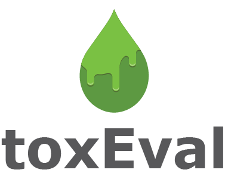
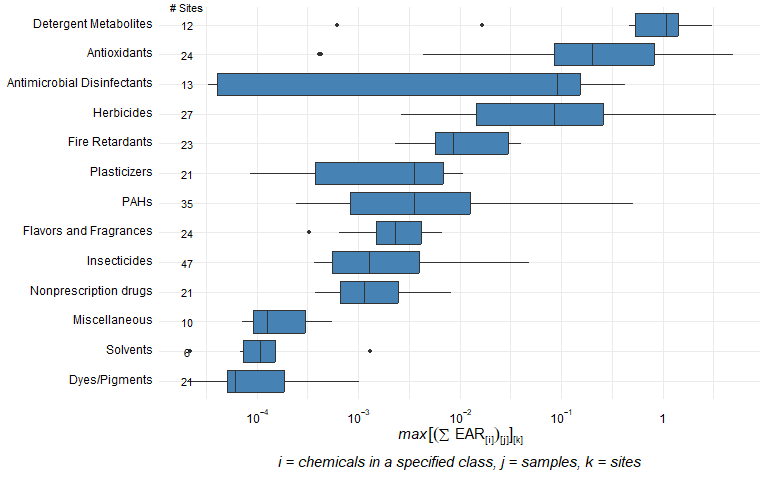
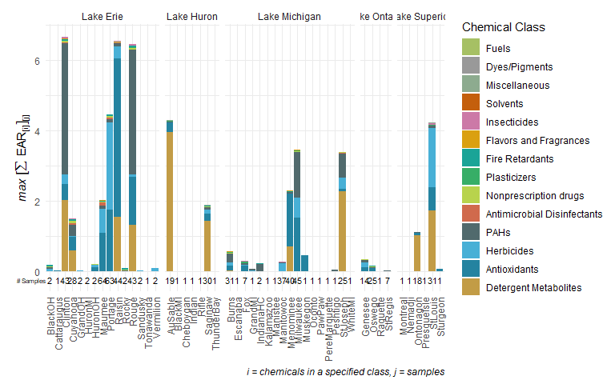
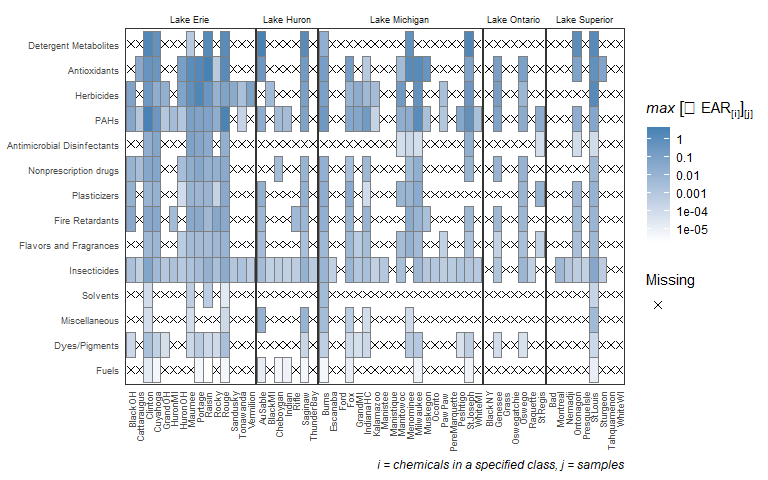
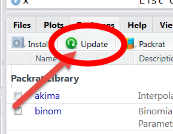

# toxEval 

[](https://owi.usgs.gov/R/packages.html#research)
[](https://cran.r-project.org/package=toxEval)
[](https://cran.r-project.org/package=toxEval)
[](https://cran.r-project.org/package=toxEval)

The `toxEval` R-package includes a set of functions to analyze,
visualize, and organize measured concentration data as it relates to
<https://www.epa.gov/chemical-research/toxicity-forecasting> or other
user-selected chemical-biological interaction benchmark data such as
water quality criteria. The intent of these analyses is to develop a
better understanding of the potential biological relevance of
environmental chemistry data. Results can be used to prioritize which
chemicals at which sites may be of greatest concern. These methods are
meant to be used as a screening technique to predict potential for
biological influence from chemicals that ultimately need to be validated
with direct biological assays.

The functions within this package allow great flexibly for exploring the
potential biological affects of measured chemicals. Also included in the
package is a browser-based application made from the `Shiny` R-package
(the app). The app is based on functions within the R-package and
includes many convenient analyses and visualization options for users to
choose. Use of the functions within the R-package allows for additional
flexibility within the functions beyond what the app offers and provides
options for the user to interact more directly with the data. The
overview in this document focuses on the R-package.

## Installation of toxEval

To install the toxEval package, you must be using R 3.0 or greater and
run the following command:

``` r
install.packages("toxEval")
```

To get cutting-edge changes, install from GitHub using the `remotes`
packages:

``` r
library(remotes)
install_gitlab("water/toxEval",
               host = "code.usgs.gov",
               build_vignettes = TRUE, 
               build_opts = c("--no-resave-data",
                              "--no-manual"))
```

## Quickstart

<p align="center">

</p>

Installation instructions are below. To quickly get going in `toxEval`,
run:

``` r
library(toxEval)
explore_endpoints()
```

Then click on the “Load Example Data” in the upper right corner. This
loads the example data that is found here:

``` r
file.path(system.file("extdata", package="toxEval"), "OWC_data_fromSup.xlsx")
```

Once the data is loaded in the app, sample R code is shown below each
tab. This can be copied into the R console (once the app is stopped…) to
use as a base for exploring the package directly in R.

Alternatively, an example workflow is shown here (also using example
data provided in the package):

``` r
library(toxEval)
#> For more information:
#> https://rconnect.usgs.gov/toxEval_docs/
#> ToxCast database: version 3.5
path_to_file <- file.path(system.file("extdata", package="toxEval"), "OWC_data_fromSup.xlsx")
tox_list <- create_toxEval(path_to_file)
ACClong <- get_ACC(tox_list$chem_info$CAS)
ACClong <- remove_flags(ACClong)

cleaned_ep <- clean_endPoint_info(end_point_info)
filtered_ep <- filter_groups(cleaned_ep, 
                  groupCol = 'intended_target_family',
                  remove_groups = c('Background Measurement','Undefined'))

chemicalSummary <- get_chemical_summary(tox_list, 
                                        ACClong, 
                                        filtered_ep)
######################################
chem_class_plot <- plot_tox_boxplots(chemicalSummary,
                                     category = 'Chemical Class')
chem_class_plot
```



``` r

######################################
plot_stacks <- plot_tox_stacks(chemicalSummary, 
                               tox_list$chem_site, 
                               category = "Chemical Class")
plot_stacks
```



``` r
######################################
plot_heat <- plot_tox_heatmap(chemicalSummary, 
                              tox_list$chem_site, 
                              category = "Chemical Class",
                              font_size = 7)
plot_heat
```



This code opens up the example file, loads it into a `toxEval` object,
grabs the pertinent ToxCast information, and creates a “chemicalSummary”
data frame that is used in many of the plot and table functions.

There are 4 vignettes to help introduce and navigate the `toxEval`
package:

| Name                                                                          | R command                                      | Description                                             |
|------------|--------------|----------------------------------------------|
| [Introduction](http://usgs-r.github.io/toxEval/articles/Introduction.html)    | `vignette("Introduction", package="toxEval")`  | Introduction to the toxEval                             |
| [Basic Workflow](http://usgs-r.github.io/toxEval/articles/basicWorkflow.html) | `vignette("basicWorkflow", package="toxEval")` | Quickstart guide to get overview of available functions |
| [Prepare Data](http://usgs-r.github.io/toxEval/articles/PrepareData.html)     | `vignette("PrepareData", package="toxEval")`   | Guide to preparing your data for toxEval analysis       |
| [Shiny App Guide](http://usgs-r.github.io/toxEval/articles/shinyApp.html)     | `vignette("shinyApp", package="toxEval")`      | Guide to the toxEval shiny application                  |

### Reporting bugs

Please consider reporting bugs and asking questions on the Issues page:
<https://github.com/USGS-R/toxEval/issues>

### Code of Conduct

We want to encourage a warm, welcoming, and safe environment for
contributing to this project. See the [code of
conduct](https://github.com/USGS-R/toxEval/blob/main/CONDUCT.md) for
more information.

### Package Support

The Water and Environmental Health Mission Areas of the USGS, as well as
the Great Lakes Restoration Initiative (GLRI) has supported the
development of the `toxEval` R-package. Further maintenance is expected
to be stable through September 2023. Resources are available primarily
for maintenance and responding to user questions. Priorities on the
development of new features are determined by the `toxEval` development
team.

[](https://www.usgs.gov/)

### Sunset date

Funding for `toxEval` is secured through summer 2023, after which bug
fixes & new features will be minimal.

## Installation of R and RStudio

This section should only need to be done once per computer.

The following link walks you through an installation of R and RStudio:

[Installation
Instructions](https://owi.usgs.gov/R/training-curriculum/installr/)

Useful links:

-   [Download R Windows](https://cran.r-project.org/bin/windows/base/)
-   [Download R Mac](https://cran.r-project.org/bin/macosx/)
-   [Download
    RStudio](https://www.rstudio.com/products/rstudio/download/)

Regularly, it is a good idea to update *ALL* your packages in R. If
using RStudio, this is quite easy, there’s an Update button in the
“Packages” tab. This checks CRAN and GRAN for updates. It is a good idea
to click this update regularly.



## Run toxEval

To run the toxEval app:

1.  Open RStudio
2.  In the Console (lower-left window of RStudio) paste the following:

``` r
library(toxEval)
explore_endpoints()
```

## Citing toxEval

``` r
citation(package = "toxEval")
#> 
#> To cite toxEval in publications, please use:
#> 
#>   De Cicco, L.A., Corsi, S.R., Villeneuve D.L, Blackwell, and B.R,
#>   Ankley, G.T., 2020, toxEval: Evaluation of measured concentration
#>   data using the ToxCast high-throughput screening database or a
#>   user-defined set of concentration benchmarks. R package version
#>   1.2.0., https://code.usgs.gov/water/toxEval, doi:10.5066/P906UQ5I
#> 
#> A BibTeX entry for LaTeX users is
#> 
#>   @Manual{,
#>     author = {Laura A. {De Cicco} and Steven R. Corsi and Daniel L. Villeneuve and Brett R. Blackwell and Gerald T. Ankley},
#>     title = {toxEval: Evaluation of measured concentration data using the ToxCast high-throughput screening database or a user-defined set of concentration benchmarks.},
#>     publisher = {U.S. Geological Survey},
#>     version = {1.2.0},
#>     address = {Reston, VA},
#>     institution = {U.S. Geological Survey},
#>     year = {2020},
#>     doi = {10.5066/P906UQ5I},
#>     url = {https://code.usgs.gov/water/toxEval},
#>   }
```

## Disclaimer

This software has been approved for release by the U.S. Geological
Survey (USGS). Although the software has been subjected to rigorous
review, the USGS reserves the right to update the software as needed
pursuant to further analysis and review. No warranty, expressed or
implied, is made by the USGS or the U.S. Government as to the
functionality of the software and related material nor shall the fact of
release constitute any such warranty. Furthermore, the software is
released on condition that neither the USGS nor the U.S. Government
shall be held liable for any damages resulting from its authorized or
unauthorized use.
