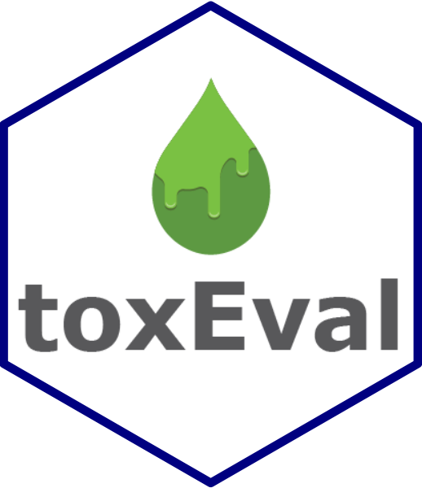

toxEval 
=====================================================================================

[](https://travis-ci.org/USGS-R/toxEval) [](https://ci.appveyor.com/project/ldecicco-USGS/toxEval) [](https://coveralls.io/github/USGS-R/toxEval?branch=master) [](https://owi.usgs.gov/R/packages.html#research)

The `toxEval` R-package includes a set of functions to analyze, visualize, and organize measured concentration data as it relates to ToxCast data (default) or other user-selected chemical-biological interaction benchmark data such as water quality criteria. The intent of these analyses is to develop a better understanding of the potential biological relevance of environmental chemistry data. Results can be used to prioritize which chemicals at which sites may be of greatest concern. These methods are meant to be used as a screening technique to predict potential for biological influence from chemicals that ultimately need to be validated with direct biological assays.

The functions within this package allow great flexibly for exploring the potential biological affects of measured chemicals. Also included in the package is a browser-based application made from the `Shiny` R-package (the app). The app is based on functions within the R-package and includes many convenient analyses and visualization options for users to choose. Use of the functions within the R-package allows for additional flexibility within the functions beyond what the app offers and provides options for the user to interact more directly with the data. The overview in this document focuses on the R-package.

Quickstart
----------

<p align="center">

</p>
Installation instructions are below. To quickly get going in `toxEval`, run:

``` r
library(toxEval)
explore_endpoints()
```

Then click on the "Load Example Data" in the upper right corner. This loads the example data that is found here:

``` r
file.path(system.file("extdata", package="toxEval"), "OWC_data_fromSup.xlsx")
```

Once the data is loaded in the app, sample R code is shown below each tab. This can be copied into the R console (once the app is stopped...) to use as a base for exploring the package directly in R.

Alternatively, an example workflow is shown here (also using example data provided in the package):

``` r
library(toxEval)
#> This information is preliminary or provisional and is subject to
#> revision. It is being provided to meet the need for timely best
#> science. The information has not received final approval by the
#> U.S. Geological Survey (USGS) and is provided on the condition
#> that neither the USGS nor the U.S. Government shall be held liable
#> for any damages resulting from the authorized or unauthorized use
#> of the information.
#> 
#> USGS Research Package:
#> https://owi.usgs.gov/R/packages.html#research
path_to_file <- file.path(system.file("extdata", package="toxEval"), "OWC_data_fromSup.xlsx")
tox_list <- create_toxEval(path_to_file)
ACClong <- get_ACC(tox_list$chem_info$CAS)
ACClong <- remove_flags(ACClong)

cleaned_ep <- clean_endPoint_info(end_point_info)
filtered_ep <- filter_groups(cleaned_ep, 
                  groupCol = 'intended_target_family',
                  remove_groups = c('Background Measurement','Undefined'))

chemicalSummary <- get_chemical_summary(tox_list, ACClong, filtered_ep)
######################################
bio_plot <- plot_tox_boxplots(chemicalSummary, 
                          category = 'Chemical Class')
bio_plot
```


This code opens up the example file, loads it into a `toxEval` object, grabs the pertinent ToxCast information, and creates a "chemicalSummary" data frame that is used in many of the plot and table functions.

There are 4 vignettes to help introduce and navigate the `toxEval` package:

<table style="width:51%;">
<colgroup>
<col width="15%" />
<col width="18%" />
<col width="18%" />
</colgroup>
<thead>
<tr class="header">
<th>Name</th>
<th>R command</th>
<th>Description</th>
</tr>
</thead>
<tbody>
<tr class="odd">
<td><a href="https://github.com/USGS-R/toxEval/blob/master/vignettes/Introduction.Rmd/">Introduction</a></td>
<td><code>vignette(&quot;Introduction&quot;, package=&quot;toxEval&quot;)</code></td>
<td>Introduction to the toxEval</td>
</tr>
<tr class="even">
<td><a href="https://github.com/USGS-R/toxEval/blob/master/vignettes/basicWorkflow.Rmd/">Basic Workflow</a></td>
<td><code>vignette(&quot;basicWorkflow&quot;, package=&quot;toxEval&quot;)</code></td>
<td>Quickstart guide to get overview of available functions</td>
</tr>
<tr class="odd">
<td><a href="https://github.com/USGS-R/toxEval/blob/master/vignettes/PrepareData.Rmd/">Prepare Data</a></td>
<td><code>vignette(&quot;PrepareData&quot;, package=&quot;toxEval&quot;)</code></td>
<td>Guide to preparing your data for toxEval analysis</td>
</tr>
<tr class="even">
<td><a href="https://github.com/USGS-R/toxEval/blob/master/vignettes/shinyApp.Rmd/">Shiny App Guide</a></td>
<td><code>vignette(&quot;shinyApp&quot;, package=&quot;toxEval&quot;)</code></td>
<td>Guide to the toxEval shiny application</td>
</tr>
</tbody>
</table>

### Reporting bugs

Please consider reporting bugs and asking questions on the Issues page: <https://github.com/USGS-R/toxEval/issues>

Follow `@USGS_R` on Twitter for updates on USGS R packages:

[](https://twitter.com/USGS_R)

### Code of Conduct

We want to encourage a warm, welcoming, and safe environment for contributing to this project. See the [code of conduct](https://github.com/USGS-R/toxEval/blob/master/CONDUCT.md) for more information.

### Package Support

The Water and Environmental Health Mission Areas of the USGS, as well as the Great Lakes Restoration Initiative (GLRI) has supported the development of the `toxEval` R-package. Further maintenance is expected to be stable through September 2018. Resources are available primarily for maintenance and responding to user questions. Priorities on the development of new features are determined by the `toxEval` development team.

[](https://www.usgs.gov/)

### Sunset date

Funding for `toxEval` is secured through summer 2021, after which bug fixes & new features will be minimal.

Installation of R and RStudio
-----------------------------

This section should only need to be done once per computer.

The following link walks you through an installation of R and RStudio:

[Installation Instructions](https://owi.usgs.gov/R/training-curriculum/installr/)

If you follow those instructions exactly, you should have the USGS R repository (GRAN) added to your R profile. If that step doesn't ring a bell, paste the following into your R console:

``` r
rprofile_path = file.path(Sys.getenv("HOME"), ".Rprofile")
write('\noptions(repos=c(getOption(\'repos\'),
    CRAN=\'https://cloud.r-project.org\',
    USGS=\'https://owi.usgs.gov/R\'))\n',
      rprofile_path, 
      append =  TRUE)

cat('Your Rprofile has been updated to include GRAN.
    Please restart R for changes to take effect.')
```

*RESTART RSTUDIO!*

Useful links:

-   [Download R Windows](https://cran.r-project.org/bin/windows/base/)
-   [Download R Mac](https://cran.r-project.org/bin/macosx/)
-   [Download RStudio](https://www.rstudio.com/products/rstudio/download/)

Installation of toxEval
-----------------------

This section should also only have to be done once. It assumes the USGS R repository (GRAN) was added to your R profile as described above.

``` r
install.packages("toxEval")
```

Regularly, it is a good idea to update *ALL* your packages in R. If using RStudio, this is quite easy, there's an Update button in the "Packages" tab. This checks CRAN and GRAN for updates. It is a good idea to click this update regularly.


Run toxEval
-----------

To run the toxEval app:

1.  Open RStudio
2.  In the Console (lower-left window of RStudio) paste the following:

``` r
library(toxEval)
explore_endpoints()
```

Citing toxEval
--------------

This package has not been reviewed and approved as a USGS-product. The implication is that `toxEval` cannot be cited in a publication. Once the software has been reviewed and approved, basic citation information will be available using the function:

``` r
citation(package = "toxEval")
```

Disclaimer
----------

This software is in the public domain because it contains materials that originally came from the U.S. Geological Survey (USGS), an agency of the United States Department of Interior. For more information, see the official USGS copyright policy at <https://www.usgs.gov/visual-id/credit_usgs.html#copyright>

Although this software program has been used by the USGS, no warranty, expressed or implied, is made by the USGS or the U.S. Government as to the accuracy and functioning of the program and related program material nor shall the fact of distribution constitute any such warranty, and no responsibility is assumed by the USGS in connection therewith.

This software is provided "AS IS."

Any use of trade, firm, or product names is for descriptive purposes only and does not imply endorsement by the U.S. Government.

[](http://creativecommons.org/publicdomain/zero/1.0/)
