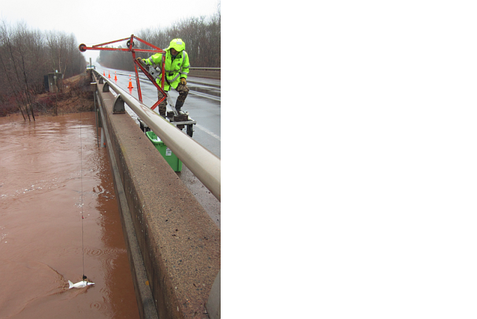
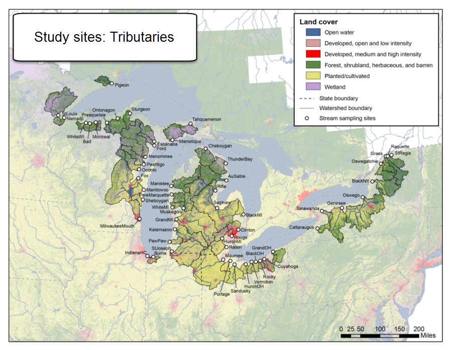
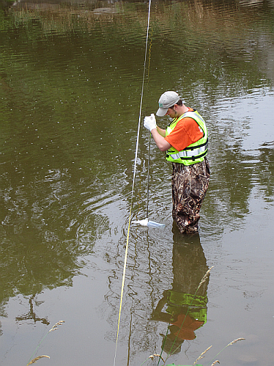
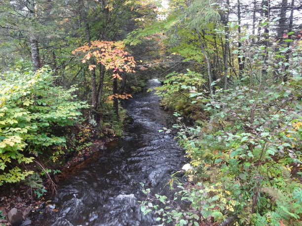

## Multi-agency team
* USEPA  (EPA NCCT)
    + Great Lakes National Program Office, GLRI
    + Mid-Continent Ecology Division, Duluth, MN
        * Tony Schroeder, Dan Villeneuve, Brett Blackwell, Gary Ankley
    + Ecosystems Research Division, Athens, GA
    + National Center for Computational Toxicolgy
* Fish and Wildlife Service
* NOAA Mussel Watch
* U.S. Army Corps of Engineers
* USGS
    + WI, OH, NY, MN, and MI Water Science Centers
    + Columbia Environmental Research Center
    + Upper Mississippi Environmental Science Center
* St. Cloud University

## Overview
<div class="columns-2">

* Sampled Great Lakes Tributaries
    * 2010-2013: Multiple trace organic compounds
    * Sampling methods: Water samples and passive samplers
* Evaluating adverse biological effect potential based on chemistry results
    * Sites with greatest potential
    * Chemicals with greatest potential
* Different methods for biological effect evaluation
    * ToxCast-based evaluation
    * Water quality guideline-based evaluation
    * Comparison of these two methods



</div>

    
## Study sites: Tributaries  {.flexbox .vcenter }




## Water quality data collected

```{r echo=FALSE, eval=TRUE}
library(knitr)
library(pander)
ws <- c("PAHs (6)", "Insecticides (6)", "Herbicides (7)", "Fire retardants (4)", "Pharmaceuticals (3)", "Plasticizers (5)", "Detergent metabolites (8)", "Antimicrobial disinfectants (3)", "Solvents (2)", "Fuels (4)", "Dye/pigments (1)", "Flavors &amp; fragrances (10)", "Sterols (4)", "Misc (3)")

ps <- c("PAHs (33)", "Organic Waste Compounds (53)", "Organochlorine Pesticides (32)", "PBDEs (5)", "Pharmaceuticals (31)", "PCB (sum of total)",rep("", 8))

df <- data.frame(ws=ws, ps=ps, stringsAsFactors=FALSE)

names(df) <- c("Water Samples: Organic Waste Compounds", "Passive Samples")

pander(df)

```
  

```{r message=FALSE, echo=FALSE}
library(pander)
library(dplyr)
library(reshape2)
library(DT)
library(toxEval)
library(knitr)

endPointInfo <- endPointInfo
# AC50 data provided in the toxEval package:
AC50gain <- AC50gain
packagePath <- system.file("extdata", package="toxEval")
#Site Info:
filePath <- file.path(packagePath, "stationINFO.RData")
load(file=filePath)
#parameter info:
filePath <- file.path(packagePath, "pCodeInfo.RData")
load(file=filePath)

pCodeInfo$class <- gsub("(^|[[:space:]])([[:alpha:]])", "\\1\\U\\2", tolower(pCodeInfo$class), perl=TRUE)
pCodeInfo$class[pCodeInfo$class == "Pah"] <- "PAH"
pCodeInfo$class[pCodeInfo$class == "Human Drug, Non Prescription"] <- "Pharmaceuticals"

pCodeInfo <- pCodeInfo[pCodeInfo$casrn != "", ]
packagePath <- system.file("extdata", package="toxEval")
filePath <- file.path(packagePath, "waterSamples.RData")
load(file=filePath)

#Correct DEET:
# casDEET <- AC50gain$casn[AC50gain$chnm == "DEET"]
# pCodeDEET <- pCodeInfo$parameter_cd[pCodeInfo$casrn == casDEET]
# dlDEET <- min(waterSamples$valueToUse_61947, na.rm = TRUE)
# waterSamples$qualifier_61947 <- ifelse(waterSamples$valueToUse_61947 <= dlDEET*4, "<", "")
# Just removing DEET:
waterSamples <- waterSamples[,-grep("61947",x = names(waterSamples))]

waterSamples$site["USGS-04157005" == waterSamples$site] <- "USGS-04157000"

waterSamplePCodes <- names(waterSamples)[grep("valueToUse", 
                                              names(waterSamples))]
waterSamplePCodes <- sapply(strsplit(waterSamplePCodes, "_"), function(x) x[2])


AC50 <- left_join(AC50gain, 
                  pCodeInfo[pCodeInfo$parameter_cd %in% waterSamplePCodes,
                            c("casrn", "parameter_units", "mlWt")],
                   by= c("casn"="casrn")) %>%
  filter(!is.na(parameter_units)) %>%
  rename(desiredUnits = parameter_units) %>%
  mutate(conversion = mlWt) %>%
  select(casn, chnm, desiredUnits, mlWt, conversion)

AC50Converted <- left_join(AC50, AC50gain, by = c("casn", "chnm"))
infoColumns <- c("casn", "chnm", "desiredUnits","mlWt", "conversion", "code","chid")

endPointData <- AC50Converted[,!(names(AC50Converted) %in% infoColumns)]
endPointData <- 10^endPointData
endPointData <- endPointData * AC50Converted$conversion
endPoint <- cbind(AC50, data.frame(endPointData))
endPoint <- rename(endPoint, Units=desiredUnits)

qualColumns <- grep("qualifier", names(waterSamples))
valColumns <- grep("valueToUse", names(waterSamples))

waterData <- waterSamples[,valColumns]
waterData[waterSamples[,qualColumns] == "<"] <- 0

newSiteKey <- setNames(stationINFO$shortName, stationINFO$fullSiteID)
wData <- cbind(waterSamples[,1:2],waterData)

valColumns <- grep("valueToUse",names(wData))

newSiteKey <- setNames(stationINFO$shortName, stationINFO$fullSiteID)

wData <- cbind(waterSamples[,1:2],waterData)
valColumns <- grep("valueToUse",names(wData))

chemicalSummary <- wData %>%
  melt(id.vars=c("ActivityStartDateGiven","site")) %>%
  mutate(variable=as.character(variable)) %>%
  filter(!is.na(value)) %>%
  rename(measuredValue=value, pCode=variable, date=ActivityStartDateGiven) %>%
  mutate(pCode=sapply(strsplit(pCode, "_"), function(x) x[2])) %>%
  left_join(pCodeInfo[c("parameter_cd","casrn","class","srsname")], by=c("pCode"="parameter_cd")) %>%
  select(srsname,casrn, class, measuredValue, site, date) %>%
  right_join(endPoint, by=c("casrn"="casn")) %>%
  select(-mlWt, -conversion, -casrn,  -Units, -srsname) %>%
  melt(id.vars = c("class", "site", "measuredValue","chnm","date")) %>% 
  filter(!is.na(value)) %>%
  mutate(variable=as.character(variable)) %>%
  rename(endPointValue=value, endPoint=variable) %>%
  mutate(EAR=measuredValue/endPointValue) 

chemSum1 <- chemicalSummary %>%
  group_by(chnm,  class, site, date) %>%
  summarize(hits= as.numeric(any(EAR > 0.1))) %>%
  group_by(chnm,  class, site) %>%
  summarize(hits=as.numeric(any(hits > 0))) %>%
  group_by(chnm, class) %>%
  summarize(freq=sum(hits)/length(unique(site)),
            nSites=sum(hits)) 

chemSum2 <- chemicalSummary %>%
  group_by(chnm,  class) %>%  
  summarize(maxEAR=max(EAR), 
            nSamples=nrow(unique(data.frame(date,site))),
            nEndPoints=length(unique(endPoint[EAR > 0.1]))) %>%
  left_join(chemSum1, by=c("chnm","class")) %>%
  data.frame %>%
  arrange(desc(freq)) %>%
  select(chnm, class, freq, maxEAR, nEndPoints, nSites, nSamples)


siteSummary <- wData %>%
  melt(id.vars=c("ActivityStartDateGiven","site")) %>%
  mutate(variable=as.character(variable)) %>%
  filter(!is.na(value)) %>%
  rename(measuredValue=value, pCode=variable, date=ActivityStartDateGiven) %>%
  mutate(pCode=sapply(strsplit(pCode, "_"), function(x) x[2])) %>%
  left_join(pCodeInfo[c("parameter_cd","casrn","class","srsname")], by=c("pCode"="parameter_cd")) %>%
  select(srsname,casrn, class, measuredValue, site, date) %>%
  right_join(endPoint, by=c("casrn"="casn")) %>%
  select(-mlWt, -conversion, -casrn,  -Units, -srsname) %>%
  melt(id.vars = c("class", "site", "date","measuredValue","chnm")) %>% 
  filter(!is.na(value)) %>%
  mutate(variable=as.character(variable)) %>%
  rename(endPointValue=value, endPoint=variable) %>%
  mutate(EAR=measuredValue/endPointValue) %>%
  mutate(site=newSiteKey[site]) %>%
  select(site, chnm, EAR, endPoint, class, date) %>% 
  arrange(site, chnm, EAR)

summ1 <- siteSummary %>%
  group_by(site, date) %>%
  summarize(hits= as.numeric(any(EAR > 0.1))) %>%
  group_by(site) %>%
  summarize(freq=sum(hits)/length(unique(date)),
            nSamples=length(unique(date))) 

summ2 <-  siteSummary %>%
  group_by(site) %>%
  summarize(nChem = length(unique(chnm[EAR > 0.1])),
            nEndPoints = length(unique(endPoint[EAR > 0.1])),
            maxEAR = max(EAR))


summary <- left_join(summ1, summ2, by="site") %>%
  arrange(desc(maxEAR))


```


```{r, echo=FALSE}

packagePath <- system.file("extdata", package="toxEval")
filePath <- file.path(packagePath, "passiveData.RData")
load(file=filePath)
# #Site Info:
# filePath <- file.path(packagePath, "stationINFO.RData")
# load(file=filePath)
# #parameter info:
# filePath <- file.path(packagePath, "pCodeInfo.RData")
# load(file=filePath)

#passive class info:
passiveCAS <- readRDS(file.path(packagePath, "passiveCAS.rds"))

pCodeInfo <- pCodeInfo[pCodeInfo$casrn != "", ]

# Some chemicals have 2 rows (different units)...
# To simplify for now, we'll ignore the duplicate chemicals:


passiveData <- left_join(passiveData, passiveCAS, by=c("CAS", "Chemical"))
passiveData <- passiveData[!duplicated(passiveData$CAS),]
passiveData$class[passiveData$Chemical == "Hexachlorobenzene (HCB)"] <-"OC Pesticides"
passiveData$class[passiveData$Chemical == "Pentachloroanisole (PCA)"] <-"OC Pesticides"
passiveData$class[is.na(passiveData$class)] <-"Pharmaceuticals"

passiveData <- passiveData[,-which(names(passiveData) == "site04249000.1")]


unitConversion <- setNames(c(10^6, 10^3), c("pg/L", "ng/L") )

AC50 <- right_join(AC50gain[,c("casn"), drop=FALSE], 
                   passiveData[,c("CAS", "Units", "mlWt","Chemical")],
                   by= c("casn" = "CAS")) %>%
  rename(desiredUnits = Units, chnm=Chemical) %>%
  filter(!is.na(mlWt)) %>%
  mutate(conversion = unitConversion[desiredUnits] * mlWt) %>%
  select(casn, chnm, desiredUnits, mlWt, conversion)

AC50Converted <- left_join(AC50, AC50gain, by = c("casn", "chnm"))
infoColumns <- c("casn", "chnm", "desiredUnits","mlWt", "conversion", "code","chid")

endPointData <- AC50Converted[,!(names(AC50Converted) %in% infoColumns)]
endPointData <- 10^endPointData
endPointData <- endPointData * AC50Converted$conversion
endPoint <- cbind(AC50, data.frame(endPointData))
endPoint <- rename(endPoint, Units=desiredUnits)

siteColumns <- grep("site",names(passiveData))
passiveData[,siteColumns] <- suppressWarnings(
  sapply(passiveData[,siteColumns], function(x) as.numeric(x)))

#For this analysis, we'll consider NA's to be 0 (other options exist):
passiveData[,siteColumns][is.na(passiveData[,siteColumns])] <- 0

newSiteKey <- setNames(stationINFO$shortName, stationINFO$fullSiteID)

infoColumns <- c("Chemical", "CAS", "Units", "MLD", "MQL", "mlWt","class")

chemicalSummary_passive <- melt(passiveData, id.vars = infoColumns) %>%
  mutate(variable=as.character(variable)) %>%
  filter(!is.na(value)) %>%
  select(srsname=Chemical,
         casrn=CAS,
         class=class,
         measuredValue=value, 
         site=variable) %>%
  right_join(endPoint, by=c("casrn"="casn")) %>%
  select(-mlWt, -conversion, -casrn,  -Units, -srsname) %>%
  melt(id.vars = c("class", "site", "measuredValue","chnm")) %>% 
  filter(!is.na(value)) %>%
  mutate(variable=as.character(variable)) %>%
  rename(endPointValue=value, endPoint=variable) %>%
  mutate(EAR=measuredValue/endPointValue) 

chemSum1_passive <- chemicalSummary_passive %>%
  group_by(chnm,  class, site) %>%
  summarize(hits= as.numeric(any(EAR > 0.1))) %>%
#   group_by(chnm,  class, site) %>%
#   summarize(hits=as.numeric(any(hits > 0))) %>%
  group_by(chnm, class) %>%
  summarize(freq=sum(hits)/length(unique(site)),
            nSites=sum(hits)) 

chemSum2_passive <- chemicalSummary_passive %>%
  group_by(chnm,  class) %>%  
  summarize(maxEAR=max(EAR), 
            nSamples=1,
            nEndPoints=length(unique(endPoint[EAR > 0.1]))) %>%
  left_join(chemSum1_passive, by=c("chnm","class")) %>%
  data.frame %>%
  select(chnm, class, freq, maxEAR, nEndPoints, nSites, nSamples) %>%
  arrange(desc(freq)) 

siteSummary_passive <- melt(passiveData, id.vars = infoColumns) %>%
  mutate(variable=as.character(variable)) %>%
  filter(!is.na(value)) %>%
  select(srsname=Chemical,
         casrn=CAS,
         class=class,
         measuredValue=value, 
         site=variable) %>%
  right_join(endPoint, by=c("casrn"="casn")) %>%
  select(-mlWt, -conversion, -casrn,  -Units, -srsname) %>%
  melt(id.vars = c("class", "site", "measuredValue","chnm")) %>% 
  filter(!is.na(value)) %>%
  mutate(variable=as.character(variable)) %>%
  rename(endPointValue=value, endPoint=variable) %>%
  mutate(EAR=measuredValue/endPointValue) %>%
  mutate(site=newSiteKey[paste0("USGS-",gsub("[^0-9]", "", site))]) %>%
  select(site, chnm, EAR, endPoint, class) %>% 
  arrange(site, chnm, EAR)

summ1_passive <- siteSummary_passive %>%
  group_by(site) %>%
  summarize(hits= as.numeric(any(EAR > 0.1)),
            nChem = length(unique(chnm[EAR > 0.1])),
            nEndPoints = length(unique(endPoint[EAR > 0.1])),
            maxEAR = max(EAR))%>%
  arrange(desc(maxEAR))


```

```{r, eval=TRUE, echo=FALSE}
AC50gain_bm <- select(pCodeInfo, srsname, casrn, AqT_EPA_acute, 
                   AqT_EPA_chronic, AqT_other_acute, AqT_other_chronic)

AC50_bm <- left_join(AC50gain_bm, pCodeInfo[pCodeInfo$parameter_cd %in% waterSamplePCodes,c("casrn", "parameter_units", "mlWt")],
                   by= c("casrn"="casrn")) %>%
  filter(!is.na(parameter_units)) %>%
  rename(desiredUnits = parameter_units) %>%
  mutate(conversion = 1) %>%
  select(casrn, srsname, desiredUnits, mlWt, conversion)

AC50Converted_bm <- left_join(AC50_bm, AC50gain_bm, by = c("casrn", "srsname")) %>%
  rename(casn=casrn, chnm=srsname)

infoColumns <- c("casn", "chnm", "desiredUnits","mlWt", "conversion")

endPointData_bm <- AC50Converted_bm[,!(names(AC50Converted_bm) %in% infoColumns)]
endPointData_bm <- endPointData_bm * AC50Converted_bm$conversion
AC50_bm <- rename(AC50_bm, casn=casrn, chnm=srsname)
endPoint_bm <- cbind(AC50_bm, data.frame(endPointData_bm))
endPoint_bm <- rename(endPoint_bm, Units=desiredUnits)

chemicalSummary_BM <- wData %>%
  melt(id.vars=c("ActivityStartDateGiven","site")) %>%
  mutate(variable=as.character(variable)) %>%
  filter(!is.na(value)) %>%
  rename(measuredValue=value, pCode=variable, date=ActivityStartDateGiven) %>%
  mutate(pCode=sapply(strsplit(pCode, "_"), function(x) x[2])) %>%
  left_join(pCodeInfo[c("parameter_cd","casrn","class","srsname")], by=c("pCode"="parameter_cd")) %>%
  select(srsname,casrn, class, measuredValue, site, date) %>%
  right_join(endPoint_bm, by=c("casrn"="casn")) %>%
  select(-mlWt, -conversion, -casrn,  -Units, -srsname) %>%
  melt(id.vars = c("class", "site", "measuredValue","chnm","date")) %>% 
  filter(!is.na(value)) %>%
  mutate(variable=as.character(variable)) %>%
  rename(endPointValue=value, endPoint=variable) %>%
  mutate(EAR=measuredValue/endPointValue) 

chemSum1_BM <- chemicalSummary_BM %>%
  group_by(chnm,  class, site, date) %>%
  summarize(hits= as.numeric(any(EAR > 0.1))) %>%
  group_by(chnm,  class, site) %>%
  summarize(hits=as.numeric(any(hits > 0))) %>%
  group_by(chnm, class) %>%
  summarize(freq=sum(hits)/length(unique(site)),
            nSites=sum(hits)) 

chemSum2_BM <- chemicalSummary_BM %>%
  group_by(chnm,  class) %>%  
  summarize(maxEAR=max(EAR), 
            nSamples=nrow(unique(data.frame(date,site))),
            nEndPoints=length(unique(endPoint[EAR > 0.1]))) %>%
  left_join(chemSum1_BM, by=c("chnm","class")) %>%
  data.frame %>%
  arrange(desc(freq)) %>%
  select(chnm, class, freq, maxEAR, nEndPoints, nSites, nSamples)

siteSummary_BM <- wData %>%
  melt(id.vars=c("ActivityStartDateGiven","site")) %>%
  mutate(variable=as.character(variable)) %>%
  filter(!is.na(value)) %>%
  rename(measuredValue=value, pCode=variable, date=ActivityStartDateGiven) %>%
  mutate(pCode=sapply(strsplit(pCode, "_"), function(x) x[2])) %>%
  left_join(pCodeInfo[c("parameter_cd","casrn","class","srsname")], by=c("pCode"="parameter_cd")) %>%
  select(srsname,casrn, class, measuredValue, site, date) %>%
  right_join(endPoint_bm, by=c("casrn"="casn")) %>%
  select(-mlWt, -conversion, -casrn,  -Units, -srsname) %>%
  melt(id.vars = c("class", "site", "date","measuredValue","chnm")) %>% 
  filter(!is.na(value)) %>%
  mutate(variable=as.character(variable)) %>%
  rename(endPointValue=value, endPoint=variable) %>%
  mutate(EAR=measuredValue/endPointValue) %>%
  mutate(site=newSiteKey[site]) %>%
  select(site, chnm, EAR, endPoint, class, date) %>% 
  arrange(site, chnm, EAR)

summ1_BM <- siteSummary_BM %>%
  group_by(site, date) %>%
  summarize(hits= as.numeric(any(EAR > 0.1))) %>%
  group_by(site) %>%
  summarize(freq=sum(hits)/length(unique(date)),
            nSamples=length(unique(date))) 

summ2_BM <-  siteSummary_BM %>%
  group_by(site) %>%
  summarize(nChem = length(unique(chnm[EAR > 0.1])),
            nEndPoints = length(unique(endPoint[EAR > 0.1])),
            maxEAR = max(EAR))


summary_BM <- left_join(summ1_BM, summ2_BM, by="site") %>%
  arrange(desc(maxEAR))

```


## Screening Endpoints Used in Analysis

* ToxCast:  (EPA NCCT)
    * "High throughput screening assays"
        * Expose living cells or isolated protiens
        * Screens for potential adverse biological effects
        * Much is focused on gaining information on biological pathways
    * 1860 compounds
    * 821 endpoints
    * AC50 used for this analysis (concentration at which activity is 50% of its maximum)
    * Exposure Activity Ratio (EAR) = concentration / AC50
* Established Water quality guidelines
    * Water sample analysis (not complete for passive samplers yet)
        * USEPA
        * Canadian Council of Ministers of the Environment
        * USGS
        * Literature

## Matches of Screening Endpoints
* ToxCast
    + Water samples
        * `r length(unique(chemSum2$chnm))` compounds of `r length(waterSamplePCodes)` total 
        * `r paste(unique(chemSum2$class), collapse=", ")`
    + Passive samplers
        * `r length(unique(chemSum2_passive$chnm))`  compounds of `r length(unique(passiveData$Chemical))` total
        *  `r paste(unique(chemSum2_passive$class), collapse=", ")`
* Water Quality Guidelines
    + Water samples
        * `r length(unique(chemSum2_BM$chnm))` compounds of `r length(waterSamplePCodes)` total
        * `r paste(unique(chemSum2_BM$class), collapse=", ")`

## ToxCast: Water Sample Chemical Summary
```{r, echo=FALSE, results='asis'}
  

datatable(chemSum2, rownames = FALSE, 
            options = list(pageLength = 10), 
            colnames=c("Chemical","Class","Fraction of Hits Per Site","Maximum EAR","Number End Points", "Sites With Hits", "Total Samples")) %>% 
    formatRound(c("maxEAR", "freq"), digits = 3)
```


## ToxCast: Water Sample Site Summary

```{r, echo=FALSE, results='asis'}
summary_display <- left_join(summary, stationINFO[,c("shortName","Ag.pct","Urban.pct")], by=c("site"="shortName")) 

datatable(summary_display, rownames = FALSE, 
          colnames=c("Station Name","Fraction of Hits Per Samples", "Total Samples","Number of Chemicals With Hits", "Number End Points", "Maximum EAR","Ag [%]","Urban [%]")) %>% 
  formatRound(c("freq","maxEAR","Ag.pct","Urban.pct"), digits = 2)
```


## ToxCast: Water Samples Map
<b>Color:</b> Maximum EAR<br/>
<b>Size:</b> Number of chemicals with hits (0-19)

```{r, echo=FALSE, results='asis', echo=FALSE, fig.width=8}

library(leaflet)
stationINFO <- stationINFO[!is.na(stationINFO$dec.lat.va),]

mapData <- left_join(stationINFO, summary, by=c("shortName"="site"))
mapData <- mapData[!is.na(mapData$dec.lat.va),]
mapData <- mapData[!is.na(mapData$nChem),]


col_types <- c("darkblue","dodgerblue","green","yellow","orange","red")
leg_vals <- c(0,1,5,10,100,1000,2500)#seq(0,2500, 500) # This is maxEAR 

cols <- colorNumeric(col_types, domain = leg_vals)
rad <- seq(5000,15000, 500)
mapData$sizes <- rad[as.numeric(cut(mapData$nChem, c(-1:19)))]

pal = colorBin(col_types, mapData$maxEAR, bins = leg_vals)

m = leaflet(mapData) %>%
  addProviderTiles("Esri.WorldPhysical") %>%
  setView(lng = -83.5, lat = 44.5, zoom=6)%>%
  addCircles(lat=~dec.lat.va, lng=~dec.long.va, 
             popup=paste('<b>',mapData$Station.Name,'</b><br/>',
                         "<table><tr><td>Frequency</td><td>",sprintf("%1.1f", mapData$freq),'</td></tr>',
                         "<tr><td>nSample</td><td>",mapData$nSamples,'</td></tr>',
                         "<tr><td>maxEAR</td><td>",sprintf("%1.1f", mapData$maxEAR),'</td></tr>',
                         "<tr><td>nChem</td><td>",mapData$nChem,'</td></tr>',
                         "<tr><td>nEndPoints</td><td>", mapData$nEndPoints,'</td></tr></table>'),
              fillColor = ~pal(maxEAR), 
             weight = 1,
             color = "black",
             fillOpacity = 0.8, radius = ~sizes, opacity = 0.8) %>%
    addLegend(
      position = 'bottomleft',
      pal=pal,
      values=~maxEAR,
      opacity = 0.8,
      title = 'Maximum EAR') 

m

```


## ToxCast: Passive Data Map 
<b>Color:</b> Maximum EAR<br/>
<b>Size:</b> Number of chemicals with hits (0-3)

```{r, echo=FALSE, results='asis', echo=FALSE, fig.width=8}

stationINFO <- stationINFO[!is.na(stationINFO$dec.lat.va),]

mapDataPassive <- left_join(stationINFO, summ1_passive, by=c("shortName"="site"))
mapDataPassive <- mapDataPassive[!is.na(mapDataPassive$dec.lat.va),]
mapDataPassive <- mapDataPassive[!is.na(mapDataPassive$maxEAR),]

col_types <- c("darkblue","dodgerblue","green","yellow","orange","red")
leg_vals <- c(0,1,2,3,5,7,9)#seq(0,2500, 500) # This is maxEAR scale

cols <- colorNumeric(col_types, domain = leg_vals)
rad <- seq(2500,15000, 2500)
mapDataPassive$sizes <- rad[as.numeric(cut(mapDataPassive$nChem, c(-1,0,1,2,3)))]
mapDataPassive$sizes[is.na(mapDataPassive$sizes)] <- 1000

pal = colorBin(col_types, mapDataPassive$maxEAR, bins = leg_vals)


map2 = leaflet(mapDataPassive) %>%
#   addProviderTiles("Hydda.Full") %>% # There are more maybe worth looking at
  addProviderTiles("Esri.WorldPhysical") %>%
  setView(lng = -83.5, lat = 44.5, zoom=6)%>%
  addCircles(lat=~dec.lat.va, lng=~dec.long.va, 
             popup=paste("<b>",mapDataPassive$Station.Name,'</b><br/>',
                         "<table><tr><td>maxEAR</td><td>",sprintf("%1.1f", mapDataPassive$maxEAR),'</td></tr>',
                         "<tr><td>nChem</td><td>",mapDataPassive$nChem,'</td></tr>',
                         "<tr><td>nEndPoints</td><td>", mapDataPassive$nEndPoints,'</td></tr></table>'),
             fillColor = ~pal(maxEAR), 
             weight = 1,
             color = "blue",
             fillOpacity = 0.8, radius = ~sizes, opacity = 0.8) %>%
    addLegend(
      position = 'bottomleft',
      pal=pal,
      values=~maxEAR,
#       colors = cols(leg_vals),
      opacity = 0.8,
#       labels = paste0(leg_vals,'-'),
      title = 'Maximum EAR')
map2

```


## Water Quality Guidelines Results
<b>Color:</b> Maximum EAR<br/>
<b>Size:</b> Number of chemicals with hits (0-10)

```{r echo=FALSE, results='asis', fig.width=8}
mapDataWQ <- left_join(stationINFO, summary_BM, by=c("shortName"="site"))
mapDataWQ <- mapDataWQ[!is.na(mapDataWQ$dec.lat.va),]
mapDataWQ <- mapDataWQ[!is.na(mapDataWQ$maxEAR),]

col_types <- c("darkblue","dodgerblue","green","yellow","orange","red")
leg_vals_BM <- c(0,1,25,50,75,100,125)#seq(0,2500, 500) # This is maxEAR scale

colsWQ <- colorNumeric(col_types, domain = leg_vals_BM)
radWQ <- seq(2500,15000, 2500)
mapDataWQ$sizes <- rad[as.numeric(cut(mapDataWQ$nChem, c(-1,0,1,5,10)))]
mapDataWQ$sizes[is.na(mapDataWQ$sizes)] <- 1000

palWQ = colorBin(col_types, mapDataWQ$maxEAR, bins = leg_vals_BM)


map4 = leaflet(mapDataWQ) %>%
  addProviderTiles("Esri.WorldPhysical") %>%
  setView(lng = -83.5, lat = 44.5, zoom=6)%>%
  addCircles(lat=~dec.lat.va, lng=~dec.long.va, 
             popup=paste("<b>",mapDataWQ$Station.Name,'</b><br/>',
                         "<table><tr><td>maxEAR</td><td>",sprintf("%1.1f", mapDataWQ$maxEAR),'</td></tr>',
                         "<tr><td>nChem</td><td>",mapDataWQ$nChem,'</td></tr>',
                         "<tr><td>nEndPoints</td><td>", mapDataWQ$nEndPoints,'</td></tr></table>'),
             fillColor = ~palWQ(maxEAR), 
             weight = 1,
             color = "blue",
             fillOpacity = 0.8, radius = ~sizes, opacity = 0.8) %>%
    addLegend(
      position = 'bottomleft',
      pal=pal,
      values=~maxEAR,
#       colors = cols(leg_vals),
      opacity = 0.8,
#       labels = paste0(leg_vals,'-'),
      title = 'Maximum EAR') 
map4  

```

## ToxCast Regression Tree Model: Number of chemicals with hits

```{r  message=FALSE, echo=FALSE, fig.show='asis',fig.width=4,fig.height=5}

library(rpart)
library(party)
library(partykit)

#################
mainTitle <- "Passive Samplers:ToxCast"
response <- "nChem"
dat <- mapDataPassive
minbucket <- 6
minsplit <- minbucket*3
set.seed(seed = 10)
form <- formula(paste(response,"~","Urban.pct + Ag.pct"))
m1 <- rpart(form,control=rpart.control(xval=10, cp=0.02, minBucket=minbucket, minsplit = minsplit),data=dat)
m2 <- prune(m1,cp=m1$cptable[which.min(m1$cptable[,"xerror"])])
plot(as.party(m2), main=mainTitle, tp_args=list(id=FALSE))


mainTitle <- "Water Samples:ToxCast"
response <- "nChem"
dat <- mapData
minbucket <- 6
minsplit <- minbucket*3
set.seed(seed = 10)
form <- formula(paste(response,"~","Urban.pct + Ag.pct"))
m1 <- rpart(form,control=rpart.control(xval=10, cp=0.02, minBucket=minbucket, minsplit = minsplit),data=dat)
m2 <- prune(m1,cp=m1$cptable[which.min(m1$cptable[,"xerror"])])
plot(as.party(m2), main=mainTitle, tp_args=list(id=FALSE))

```

## Comparing ToxCast to WQGs: Number of chemicals with hits

```{r echo=FALSE, message = FALSE, fig.show='asis',fig.width=4,fig.height=5}

mainTitle <- "Water Samples:ToxCast"
response <- "nChem"
dat <- mapData
minbucket <- 6
minsplit <- minbucket*3
set.seed(seed = 10)
form <- formula(paste(response,"~","Urban.pct + Ag.pct"))
m1 <- rpart(form,control=rpart.control(xval=10, cp=0.02, minBucket=minbucket, minsplit = minsplit),data=dat)
m2 <- prune(m1,cp=m1$cptable[which.min(m1$cptable[,"xerror"])])
plot(as.party(m2), main=mainTitle, tp_args=list(id=FALSE))


mainTitle <- "Water Samples:WQGs"
response <- "nChem"
dat <- mapDataWQ
minbucket <- 6
minsplit <- minbucket*3
set.seed(seed = 10)
form <- formula(paste(response,"~","Urban.pct + Ag.pct"))
m1 <- rpart(form,control=rpart.control(xval=10, cp=0.02, minBucket=minbucket, minsplit = minsplit),data=dat)
m2 <- prune(m1,cp=m1$cptable[which.min(m1$cptable[,"xerror"])])
plot(as.party(m2), main=mainTitle, tp_args=list(id=FALSE))

```

## Comparisons


<table width="100%">
<col style="width:36%">
<col style="width:36%">
<col style="width:28%">
<tr>
<td>ToxCast</td>
<td>ToxCast</td>
<td>WQG</td>
</tr>
<tr>
<td>Water Samples</td>
<td>Passive Data</td>
<td>Water Samples</td>
</tr>
</table>


<div class="testingStuff">

```{r echo=FALSE}
# ToxCast Water Samples:
toxWS <- chemSum2 %>%
  arrange(desc(freq)) %>%
  select(chnm,class,freq) %>%
  rename(Chemical=chnm, Class=class)

toxWS <- toxWS[1:12,1:2]

toxPassive <- chemSum2_passive %>%
  arrange(desc(freq)) %>%
  select(chnm, class, freq) %>%
  rename(Chemical=chnm, Class=class)
  
toxPassive <- toxPassive[1:12,1:2]
toxPassive$Class[toxPassive$Class == "PAHs"] <- "PAH"

tradWS <- chemSum2_BM %>%
  arrange(desc(freq)) %>%
  select(chnm, class, freq) %>%
  rename(Chemical=chnm, Class=class)

tradWS <- tradWS[1:12,1:2]

combo <- cbind(toxWS, toxPassive, tradWS)
emphasize.strong.cells(which(combo == "PAH", arr.ind = TRUE))
pander(combo,row.names = FALSE, style = 'simple', split.table = Inf)


```


</div>

## Comparisons

<table width="100%">
<col style="width:36%">
<col style="width:36%">
<col style="width:28%">
<tr>
<td>ToxCast</td>
<td>ToxCast</td>
<td>WQG</td>
</tr>
<tr>
<td>Water Samples</td>
<td>Passive Data</td>
<td>Water Samples</td>
</tr>
</table>

<div class="testingStuff">


```{r, echo=FALSE}
emphasize.strong.cells(which(combo == "Pharmaceuticals", arr.ind = TRUE))
pander(combo,row.names = FALSE, style = 'simple', split.table = Inf)
```


</div>

## Comparisons

<table width="100%">
<col style="width:36%">
<col style="width:36%">
<col style="width:28%">
<tr>
<td>ToxCast</td>
<td>ToxCast</td>
<td>WQG</td>
</tr>
<tr>
<td>Water Samples</td>
<td>Passive Data</td>
<td>Water Samples</td>
</tr>
</table>

<div class="testingStuff">


```{r, echo=FALSE}
emphasize.strong.cells(which(combo == "Herbicide" | combo == "Insecticide", arr.ind = TRUE))
pander(combo,row.names = FALSE, style = 'simple', split.table = Inf)
```

</div>

## Challenges with this work
* Detection levels
    * ToxCast: Some compounds have adverse effects lower than analytical reporting limits
    * Water samples
        * Dichlorvos  (min EAR = 36)
        * Metolachlor (min EAR = 14)
        * Cotinine    (min EAR = 7)
        * Naphthalene (min EAR = 1.7)
        * dl-Menthol  (min EAR = 1.4)
* Compounds included
    * The numbers are increasing, but many are still not included
        * ToxCast and water quality guidelines/literature
* Interpretation of ToxCast in the environmental setting
        
## Summary
<div class="columns-2">
* Multiple contaminant classes could be influential
* The classes that appear to be of largest concern include:
    * PAHs
    * Pesticides
    * Pharmaceuticals
* Adverse effect potential exists in urban and agricultural sites
* Combining multiple evaluation methods can provide a more comprehensive assessment
* Much work yet to be done to better understand how to use these methods effectively
    + Mixtures, endocrine disruptors, influential factors (season, hydrology...)
    + Direct ToxCast analysis of environmental samples



## Questions {.flexbox .vcenter}



## Work Remaining For This Analysis
* ToxCast
    * Chemical mixtures 
* Passive samplers
    * Compile established water quality guidelines and compare
* Endocrine disruptors
    * Comparison of estrogenic equivalents to ToxCast results
* Factors that may influence biological effects
    * Seasonality
    * Hydrologic condition
    * Land use
* ToxCast direct environmental sample analysis
    * Comparison with analysis using water chemistry data alone with ToxCast
    
    
## Passive Sample: Chemical Summary

```{r, echo=FALSE, results='asis'}
chemSum2_passive <- chemSum2_passive[,-7]
  datatable(chemSum2_passive, rownames = FALSE, 
            options = list(pageLength = 10),
            colnames=c("Chemical","Class","Fraction of Hits Per Site","Maximum EAR","Number of End Points", "Sites With Hits")) %>% 
    formatRound(c("maxEAR", "freq"), digits = 4)

```


## Passive Sample: Site Summary

```{r, echo=FALSE, results='asis'}
summary_display_passive <- left_join(summ1_passive, stationINFO[,c("shortName","Ag.pct","Urban.pct")], by=c("site"="shortName")) 
summary_display_passive <- summary_display_passive[,-2]
datatable(summary_display_passive, rownames = FALSE,
          colnames=c("Station", "Number of Chemicals with Hits", "Number End Points", "Maximum EAR", "Ag [%]", "Urban [%]")) %>% 
#           options = list(pageLength = 50)) %>% 
  formatRound(c("maxEAR"), digits = 2)
```

## ToxCast: Comparison of Water Sample and Passive Sample Results
<b>Color:</b> Maximum EAR<br/>
<b>Size:</b> Number of chemicals with hits

```{r, echo=FALSE, results='asis', fig.width=8, warning=FALSE}

mapDataPassive$Passive <- rep(TRUE, nrow(mapDataPassive))
mapDataPassive$nSamples <- rep(1, nrow(mapDataPassive))
mapData$Passive <- rep(FALSE, nrow(mapData))

comboMap <- rbind(mapDataPassive[,-which("hits" == names(mapDataPassive))], 
                  mapData[,-which("freq" == names(mapData))])

latOffset <- 0.1

comboMap$dec.lat.va[comboMap$Passive] <- comboMap$dec.lat.va[comboMap$Passive] + latOffset
comboMap$dec.lat.va[!comboMap$Passive] <- comboMap$dec.lat.va[!comboMap$Passive] - latOffset

col_types <- c("darkblue","dodgerblue","green","yellow","orange","red")
leg_vals_WS <- c(0,1,5,10,100,1000,2500)#seq(0,2500, 500) # This is maxEAR scale
cols_WS <- colorNumeric(col_types, domain = leg_vals_WS)
pal_WS = colorBin(col_types, comboMap$maxEAR, bins = leg_vals_WS)

leg_vals_P <- c(0,1,2,3,5,7,9)#seq(0,2500, 500) # This is maxEAR scale
cols_P <- colorNumeric(col_types, domain = leg_vals_P)
pal_P = colorBin(col_types, mapDataPassive$maxEAR, bins = leg_vals_P)


map3 = leaflet() %>%
  addProviderTiles("Esri.WorldPhysical") %>%
  setView(lng = -83.5, lat = 44.5, zoom=6)%>%
  addCircles(lat=comboMap$dec.lat.va[comboMap$Passive], lng=comboMap$dec.long.va[comboMap$Passive], 
             popup=paste("Passive:<b>",comboMap$Station.Name[comboMap$Passive],'</b><br/>',
                         "maxEAR:",sprintf("%1.1f", comboMap$maxEAR[comboMap$Passive]),'<br/>',
                         "nChem:",comboMap$nChem[comboMap$Passive],'<br/>',
                         "nEndPoints", comboMap$nEndPoints[comboMap$Passive],'<br/>'),
             fillColor = pal_P(comboMap$maxEAR[comboMap$Passive]), 
             weight = 1,
             color = "black",
             fillOpacity = 0.8, opacity = 0.8,
             radius = comboMap$sizes[comboMap$Passive] ) %>%
    addLegend(
      position = 'bottomleft',
      pal=pal_P,
      values=comboMap$maxEAR[comboMap$Passive],
      opacity = 0.8,
      title = 'Passive maxEAR') %>%
  addCircles(lat=comboMap$dec.lat.va[!comboMap$Passive], lng=comboMap$dec.long.va[!comboMap$Passive], 
             popup=paste("<font color='red'>Water Samples:</font><b>",comboMap$Station.Name[!comboMap$Passive],'</b><br/>',
                         "<table><tr><td>maxEAR</td><td>",sprintf("%1.1f", comboMap$maxEAR[!comboMap$Passive]),'</td></tr>',
                         "<tr><td>nChem</td><td>",comboMap$nChem[!comboMap$Passive],'</td></tr>',
                         "<tr><td>nEndPoints</td><td>", comboMap$nEndPoints[!comboMap$Passive],'</td></tr></table>'),
             fillColor = pal_WS(comboMap$maxEAR[!comboMap$Passive]), 
             weight = 1.5,
             color = "red",
             fillOpacity = 0.8, 
             radius = comboMap$sizes[!comboMap$Passive], 
             opacity = 0.8) %>%
    addLegend(
      position = 'topright',
      pal=pal_WS,
      values=comboMap$maxEAR[!comboMap$Passive],
      opacity = 0.8,
      title = '<font color="red">Water Samples</font> maxEAR')
map3


```


## Traditional Benchmarks

```{r results='asis', echo=FALSE}
  datatable(chemSum2_BM, rownames = FALSE, 
            options = list(pageLength = 10),
            colnames=c("Chemical","Class","Fraction of Sites with Hits", "Maximum EAR","Number End Points","Sites with Hits","Total Samples")) %>% 
    formatRound(c("maxEAR", "freq"), digits = 4)

```

## Traditional Benchmarks: Site Summary

```{r results='asis', echo=FALSE}
summary_display_BM <- left_join(summary_BM, stationINFO[,c("shortName","Ag.pct","Urban.pct")], by=c("site"="shortName")) 

datatable(summary_display_BM, rownames = FALSE,
          colnames=c("Station","Hits Per Samples","Total Samples","Number of Chemicals With Hits","Number End Points","Maximum EAR","Ag [%]","Urban [%]")) %>% 
  formatRound(c("freq","maxEAR", "Ag.pct", "Urban.pct"), digits = 2)

```
