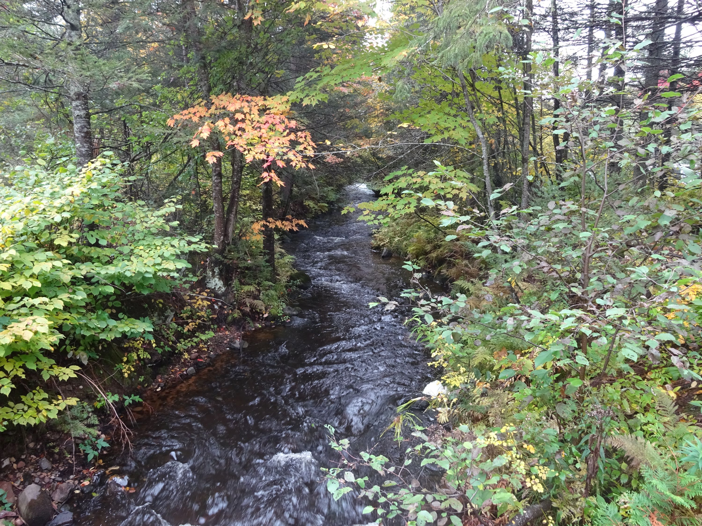

## Multi-agency team
* USEPA ORD
    + Mid-Continent Ecology Division, Duluth, MN
        * Tony Schroeder, Dan Villeneuve, Brett Blackwell, Gary Ankley
    + Ecosystems Research Division, Athens, GA
    + National Center for Computational Toxicolgy
* Fish and Wildlife Service
* NOAA Mussel Watch
* U.S. Army Corps of Engineers
* USGS
    + WI, OH, NY, MN, and MI Water Science Centers
    + Columbia Environmental Research Center
    + Upper Mississippi Environmental Science Center
* St. Cloud University

## Overview
* 58 Great Lakes Tributaries sampled from 2010-2013 for GLRI
* Trace organic compounds measured in samples
* Sampling methods used: Water samples and passive samplers
* Adverse biological effect potential based on chemistry results
    * Sites with greatest potential
    * Chemicals with greatest potential
* Different methods for biological effect evaluation
    * ToxCast-based evaluation
    * Water quality guideline-based evaluation
    * Comparison of these two methods

## Study sites: Tributaries of the Great Lakes {.flexbox .vcenter}

## Water quality data collected

* Water samples: Organic Waste Compounds
    * PAHs (6) 
    * Insecticides (6)
    * Herbicides (7)
    * Fire retardants (4)
    * Human drugs, nonRx (3)
    * Plasticizers (5)
    * Detergent metabolites (8)
    * Antimicrobial disinfectants (3)
    * Fuels (4)
    * Solvents (2)
    * Dye/pigments (1)
    * Flavors & fragrances (10)
    * Sterols (4)
    * Misc (3)

*BEGIN SECOND COLUMN HERE

* Passive samplers (155 compounds): One deployment of POCIS and SPMD samplers
    * PAHs (33)
    * Organochlorine Pesticides (32)
    * Pharmaceuticals (31)
    * Organic Waste Compounds (53)
    * PBDEs (5)
    * PCB (sum of total)
    
## Screening Endpoints Used in Analysis
* ToxCast: 
    * "High throughput screening assays"
        * Expose living cells or isolated protiens
        * Screens for potential adverse biological effects
        * Much is focused on gaining information on biological pathways
    * 1860 compounds
    * 821 endpoints
    * AC50 used for this analysis (concentration at which activity is 50% of its maximum)
* Water quality guidelines
    * Water sample analysis (not complete for passive samplers yet)
        * Established water quality guidelines
            * USEPA
            * Canadian Council of Ministers of the Environment
            * USGS
            * Literature

## Compound Matches for Screening Endpoints
* ToxCast
    * Water samples
        * XX compounds of 69 total 
        * (LIST CLASSES THAT HAVE COMPOUNDS HERE)
    * Passive samplers
        * XX compounds of 166 total
        * (LIST CLASSES THAT HAVE COMPOUNDS HERE)
* Water Quality Guidelines
    * Water samples
    * (LIST CLASSES THAT HAVE COMPOUNDS HERE)
        * XX compounds of YY total
        
## ToxCast Results: Water Samples

SORTABLE CHEMICAL TABLE

##ToxCast Results: Water Samples

SORTABLE SITES TABLE

## Toxcast Results: Water Samples

Single bubble map

## Toxcast Results: Passive Samplers

SINGLE BUBBLE MAP

## Toxcast Results: Passive Samplers

Double BUBBLE MAP: Water samples & passive samples

## Water Quality Guidelines Results

Double BUBBLE MAP: Water samples ToxCast & water samples WQG

## Comparison of ToxCast and Water Quality Guideline Results

Water samples: ToxCast and WQG, passive samplers: ToxCast

## Challenges with this work
* Detection levels
    * ToxCast: Some compounds have adverse effects lower than analytical reporting limits
    * Water samples
        * Dichlorvos  (min EAR = 36)
        * Metolachlor (min EAR = 14)
        * Cotinine    (min EAR = 7)
        * Naphthalene (min EAR = 1.7)
        * dl-Menthol  (min EAR = 1.4)
* Compounds included
    * The numbers are increasing, but many are still not included
        * ToxCast and water quality guidelines/literature
* Interpretation of ToxCast in the environmental setting
        
## Work Remaining For This Analysis
* ToxCast
    * Chemical mixtures: how to evaluate within ToxCast results 
    * Zebrafish developmental toxicity testing (subset of ToxCast chemicals)
* Passive samplers
    * Compile established water quality guidelines and compare
        * Toxicity
        * Endocrine disruptors
* Endocrine disruptors
    * Comparison of estrogenic equivalents to ToxCast results
* Factors that may influence biological effects
    * Seasonality
    * Hydrologic condition
    * Land use
* Use all methods to summarize potential effects
    * By site
    * By Chemical
* ToxCast direct environmental sample analysis
    * Comparison with analysis using water chemistry data alone with ToxCast
    
## Summary
* Multiple methods can be used to evaluate potential biological effects
* Different conclusions may be reached based on methods
* Combining methods:
    * Note commonalities and differences in final evaluations
* Adverse effect potential exists and urban and agricultural sites
* Multiple contaminant classes could be influential
* The classes that appear to be of largest concern include:
    * PAHs
    * Pesticides
    * Pharmaceuticals
* Keep in mind the limited chemicals and classes included here
* Much work yet to be done to better understand how to use these methods effectively

## Questions {.flexbox .vcenter}

FILL SCREEN WITH PHOTO
