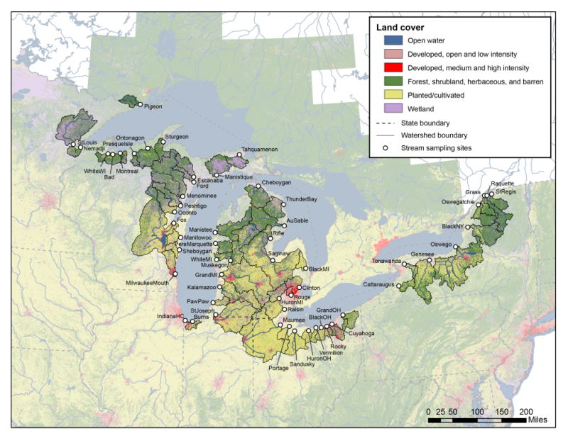

## Multi-agency team
* USEPA ORD
    + Mid-Continent Ecology Division, Duluth, MN
    + Ecosystems Research Division, Athens, GA
* Fish and Wildlife Service
* NOAA Mussel Watch
* U.S. Army Corps of Engineers
* USGS
    + WI, OH, NY, MN, and MI Water Science Centers
    + Minnesota Water Science Center
    + Upper Mississippi Environmental Science Center
* St. Cloud University

## Overview
* Topic 1
* Topic 2
* Topic 3

## Objectives
* Evaluate Great Lakes tributaries for adverse biological impact based on water chemistry monitoring data
    * Water chemistry and passive sampler data 
    * Compare water chemistry and passive sampler data to bioassay endpoints
        * ToxCast^TM^
        * Water quality guidelines
        * Estrogenic equivalents
    * Characterize sites based on potential adverse impact
    * Prioritize contaminants based on prevalence of potential adverse impact

## Study sites: Tributaries of the Great Lakes {.flexbox .vcenter}

## Water quality data collected

* Water samples
    * Organic Waste Compounds
    * 15 Classes of contaminants
        * PAHs (6) 
        * Insecticides (6)
        * Herbicides (7)
        * Fire retardants (4)
        * Human drugs, nonRx (3)
        * Plasticizers (5)
        * Detergent metabolites (8)
        * Antimicrobial disinfectants (3)
        * Fuels (4)
        * Solvents (2)
        * Dye/pigments (1)
        * Flavors & fragrances (10)
        * Sterols (4)
        * Misc (3)

## Water quality data collected (contd.)
* Passive samplers (155 compounds)
* One deployment of POCIS and SPMD samplers
    * PAHs (33)
    * Organochlorine Pesticides (32)
    * Pharmaceuticals (31)
    * Organic Waste Compounds (53)
    * PBDEs (5)
    * PCB (sum of total)
    
## Screening Endpoints Used in Analysis
* ToxCast
    * General info on toxcast
    * 1800??? compounds
    * 851 endpoints
* Water quality guidelines
    * Water sample analysis
        * Established water quality guidelines

## Compound Matches for Screening Endpoints
* ToxCast
    * Water samples
        * XX compounds of YY total 
        * (LIST CLASSES THAT HAVE COMPOUNDS HERE)
    * Passive samplers
        * XX compounds of YY total
        * (LIST CLASSES THAT HAVE COMPOUNDS HERE)
* Water Quality Guidelines
    * Water samples
    * (LIST CLASSES THAT HAVE COMPOUNDS HERE)
        * XX compounds of YY total
    *Passive samplers
        * Not yet complete
## ToxCast Results
Sites table??
??Additional slide for map??

## Toxcast Results
Chemicals table

## Water Quality Guidelines Results

## Work Remaining For This Analysis
* ToxCast
    * Zebrafish LIVERS???
* Passive samplers
    * Compile established water quality guidelines and compare
        * Toxicity
        * Endocrine disruptors
* Endocrine disruptors
    * Comparison of estrogenic equivalents to ToxCast results
* Factors that may influence biological effects
    * Seasonality
    * Hydrologic condition
    * Land use
  