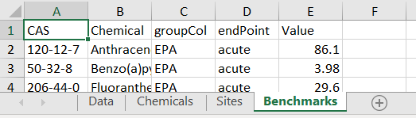

```{r setup, include=FALSE}
knitr::opts_chunk$set(echo = TRUE,
                      warning = FALSE,
                      message = FALSE)

library(dplyr)
library(toxEval)
```

# Introduction

The majority of the examples in this documentation create EAR values from concentration "benchmarks" set by the ToxCast database. Here we describe a way to provide your own custom benchmarks data.

# Preparing Benchmarks {#dataRequirements}

Input data for a custom toxEval input file should be prepared in a Microsoft &trade; Excel file using specifically named sheets (also known as tabs). There are 4 mandatory sheets (Data, Chemical, Sites, Benchmarks). The sheets should appear as follows (although the order is not important):

```{r tabIMAGE, echo=FALSE}

library(tidyr)
library(dplyr)

raw_benchmarks <- read.csv(text='CAS,chm_nm,source,value
120-12-7,Anthracene,EPA_acute,86.1
50-32-8,Benzo(a)pyrene,EPA_acute,3.98
206-44-0,Fluoranthene,EPA_acute,29.6
91-20-3,Naphthalene,EPA_acute,803
85-01-8,Phenanthrene,EPA_acute,79.7
129-00-0,Pyrene,EPA_acute,42
98-82-8,Cumene,EPA_acute,2140
1912-24-9,Atrazine,EPA_acute,360
57837-19-1,Metalaxyl,EPA_acute,14000
87-86-5,Pentachlorophenol,EPA_acute,19
1610-18-0,Prometon,EPA_acute,98
63-25-2,Carbaryl,EPA_acute,0.85
2921-88-2,Chlorpyrifos,EPA_acute,0.05
333-41-5,Diazinon,EPA_acute,0.17
62-73-7,Dichlorvos,EPA_acute,0.035
84852-15-3,"4-Nonylphenol, branched",EPA_acute,28
120-12-7,Anthracene,EPA_chronic,20.7
50-32-8,Benzo(a)pyrene,EPA_chronic,0.014
206-44-0,Fluoranthene,EPA_chronic,7.11
91-20-3,Naphthalene,EPA_chronic,24
85-01-8,Phenanthrene,EPA_chronic,6.3
129-00-0,Pyrene,EPA_chronic,10.1
84-66-2,Diethyl phthalate,EPA_chronic,220
90-12-0,1-Methylnaphthalene,EPA_chronic,2.1
91-57-6,2-Methylnaphthalene,EPA_chronic,4.7
98-82-8,Cumene,EPA_chronic,2.6
1912-24-9,Atrazine,EPA_chronic,60
57837-19-1,Metalaxyl,EPA_chronic,100
87-86-5,Pentachlorophenol,EPA_chronic,13
63-25-2,Carbaryl,EPA_chronic,0.5
2921-88-2,Chlorpyrifos,EPA_chronic,0.04
333-41-5,Diazinon,EPA_chronic,0.043
62-73-7,Dichlorvos,EPA_chronic,0.0058
84852-15-3,"4-Nonylphenol, branched",EPA_chronic,6.6
106-46-7,"1,4-Dichlorobenzene",EPA_chronic,15
75-25-2,Bromoform,EPA_chronic,320
80-05-7,Bisphenol A,other_acute,1518
120-12-7,Anthracene,other_acute,13
50-32-8,Benzo(a)pyrene,other_acute,0.24
206-44-0,Fluoranthene,other_acute,3980
91-20-3,Naphthalene,other_acute,190
85-01-8,Phenanthrene,other_acute,30
84-66-2,Diethyl phthalate,other_acute,1800
90-12-0,1-Methylnaphthalene,other_acute,37
78-59-1,Isophorone,other_acute,117000
127-18-4,Tetrachloroethene (PERC),other_acute,830
63-25-2,Carbaryl,other_acute,3.3
2921-88-2,Chlorpyrifos,other_acute,0.02
106-46-7,"1,4-Dichlorobenzene",other_acute,180
75-25-2,Bromoform,other_acute,2300
80-05-7,Bisphenol A,other_chronic,0.86
120-12-7,Anthracene,other_chronic,0.012
50-32-8,Benzo(a)pyrene,other_chronic,0.015
206-44-0,Fluoranthene,other_chronic,0.04
91-20-3,Naphthalene,other_chronic,1.1
85-01-8,Phenanthrene,other_chronic,0.4
129-00-0,Pyrene,other_chronic,0.025
84-66-2,Diethyl phthalate,other_chronic,110
90-12-0,1-Methylnaphthalene,other_chronic,2.1
91-57-6,2-Methylnaphthalene,other_chronic,330
78-59-1,Isophorone,other_chronic,920
127-18-4,Tetrachloroethene (PERC),other_chronic,45
1912-24-9,Atrazine,other_chronic,1.8
314-40-9,Bromacil,other_chronic,5
51218-45-2,Metolachlor,other_chronic,7.8
63-25-2,Carbaryl,other_chronic,0.2
2921-88-2,Chlorpyrifos,other_chronic,0.002
84852-15-3,"4-Nonylphenol, branched",other_chronic,1
106-46-7,"1,4-Dichlorobenzene",other_chronic,9.4
75-25-2,Bromoform,other_chronic,320',
stringsAsFactors = FALSE)

path_to_file <- file.path(system.file("extdata",
                                      package="toxEval"),
                          "OWC_data_fromSup.xlsx") 

bench <- raw_benchmarks %>%
  rename(Value = value) %>%
  separate(source, c("groupCol", "endPoint"), sep = "_") %>% 
  left_join(select(tox_chemicals, 
                   CAS = casn,
                   Chemical = chnm), by = "CAS")

bench$Chemical[is.na(bench$Chemical)] <- bench$chm_nm[is.na(bench$Chemical)]

tox_list <- create_toxEval(path_to_file)

tox_list_wq_bench <- list(Data = tox_list$chem_data,
                          Chemicals = tox_list$chem_info,
                          Sites = tox_list$chem_site,
                          Benchmarks = bench)

library(openxlsx)

write.xlsx(tox_list_wq_bench, 
           file = here::here("vignettes/OWC_custom_bench.xlsx"))


```

## Mandatory Information

The mandatory columns are: CAS, Value, groupCol, Chemical. Additional column can be included, but will be ignored by `toxEval` functions. 

* CAS: A character column defining the chemicals via their Chemical Abstracts Service (CAS) registry.

* Chemical: A character column defining the name of the chemicals. This is necessary for labels because the only information `toxEval` uses by default for chemical names are the names assigned by the ToxCast database for an associated CAS. 

* endPoint: A character column naming the benchmark. This is analogous to the assay names in the ToxCast analysis.

* Value: The concentration (in identical units as what is reported in the "Data" sheet) of the benchmark.

* groupCol: A character column that groups endpoints. This is analogous to the Biological groupings from the ToxCast analysis.

# Explore Benchmarks

In this section, we will assume there is a toxEval input file named "OWC_custom_bench.xlsx", as descibed in [Preparing Benchmarks](#dataRequirements). The next section [Create Example File](#setupExample) will walk through creating the "OWC_custom_bench.xlsx" file on the example data provided within the `toxEval` package.

## Toxicity Quotient

This example uses water quality guidelines/benchmarks from EPA and other sources. The guidelines are classified into chronic and acute categories.

```{r get_bench, eval=FALSE}
tox_list_bench <- create_toxEval("OWC_custom_bench.xlsx")
```

```{r getBenchstuffFoReal, echo=FALSE}
tox_list_bench <- create_toxEval(here::here("vignettes/OWC_custom_bench.xlsx"))

```

Using a "Benchmark" tab in the input file, you can skip the `ACC` and `filtered_ep` arguments:
```{r createBenchmarks}
summary_bench <- get_chemical_summary(tox_list_bench)
```

For ToxCast EARs, it makes sense in the boxplot visualization to sum the EARs of all endpoints for a single chemical. This is due to the specific nature of the ToxCast endpoint suite of tests.

Some benchmarks such as these water quality guidelines already take into account the overall effects, and you do not want to sum those values. There is an argument in the `plot_tox_boxplots` function that allows you to specify: `sum_logic` (where TRUE sums the EARs for each chemical, and FALSE does not).

```{r plotBenchChems}
plot_tox_boxplots(summary_bench, 
                  category = "Chemical", 
                  sum_logic = FALSE,
                  x_label = "Toxicity Quotient")
```

```{r plotBenchmarksStack, fig.height=4}
plot_tox_stacks(summary_bench,
                chem_site = tox_list_bench$chem_site,
                category = "Chemical", 
                sum_logic = FALSE,
                y_label = "Toxicity Quotient",
                include_legend = FALSE)

```

The `category` argument can be set to  "Biological", and which then shows the distributions of the acute and chronic groupings. 

```{r otherPlot, fig.height=2}
plot_tox_endpoints(summary_bench, 
                   category = "Biological",
                   x_label = "Toxicity Quotient")
```

## Compare with ToxCast

Let's get the ToxCast example chemical summary as described in the [Basic Workflow](basicWorkflow.html):

```{r compareTox}
path_to_file <- file.path(system.file("extdata",
                                      package="toxEval"),
                          "OWC_data_fromSup.xlsx") 
tox_list <- create_toxEval(path_to_file)
ACC <- get_ACC(tox_list$chem_info$CAS)
ACC <- remove_flags(ACC = ACC)

cleaned_ep <- clean_endPoint_info(end_point_info)
filtered_ep <- filter_groups(cleaned_ep)


summary_tox <- get_chemical_summary(tox_list, 
                                    ACC, 
                                    filtered_ep)

```

We can use the `side_by_side_data` function to create a single data frame that the `toxEval` plotting functions can use.

```{r sideBySide}
gd_tox <- graph_chem_data(summary_tox)
gd_bench <- graph_chem_data(summary_bench, 
                            sum_logic = FALSE)

combo <- side_by_side_data(gd_tox, gd_bench, 
                           left_title = "ToxCast", 
                           right_title = "WQ Benchmarks")
```

The "combo" data frame has a new column "guide_side", and is a factor containing the "left_title" and "right_title". This will allow us to facet the output of the chemical boxplots. The ordering of the chemicals is primarily based on the "left" input (so in this case, the ToxCast EARs). 

The output of all the `toxEval` graphs are `ggplot2` objects. What this means is you can continue to customize the object using `ggplot2` functions. In this case, we can use `facet_grid` to separage the data by the column "guide_side". The name of the facet column must be include without quotes, as shown here:

```{r sideBySidePlot, fig.height=9}
plot_chemical_boxplots(combo, guide_side,
                       x_label = "") +
  ggplot2::facet_grid(. ~ guide_side, scales = "free_x")


```


## Compare with Concentration

We can create a summary data frame that has concentrations instead of EARs as well. We've included a function `get_concentration_summary` to make the chemical_summary data frame input directly from the tox_list.

```{r concCompare, fig.height=9}
summary_conc <- get_concentration_summary(tox_list)
gd_conc <- graph_chem_data(summary_conc)

combo2 <- side_by_side_data(gd_conc, gd_bench, 
                           left_title = "Concentration", 
                           right_title = "WQ Benchmarks")

plot_chemical_boxplots(combo2, guide_side, 
                       x_label = "") +
  ggplot2::facet_grid(. ~ guide_side, scales = "free_x")


```

## Concentrations, benchmarks, and ToxCast

```{r allThree, fig.height=9}

combo_all_3 <- combo2 %>% 
  bind_rows(combo %>% 
              filter(guide_side == "ToxCast")
            )

combo_all_3$Class <- factor(combo_all_3$Class, 
                       levels = levels(combo2$Class))
combo_all_3$chnm <- factor(combo_all_3$chnm, 
                       levels = levels(combo2$chnm))
combo_all_3$guide_side <- factor(combo_all_3$guide_side, 
                       levels = c("Concentration",
                                  "WQ Benchmarks",
                                  "ToxCast"))

plot_chemical_boxplots(combo_all_3, guide_side, 
                       x_label = "") +
  ggplot2::facet_grid(. ~ guide_side, scales = "free_x")

```

# Create Example File {#setupExample}

This section describes how to use the "benchmarks" option to create a custom analysis. 

The example data provided in `toxEval` is taken from the supplemental information in Baldwin, et al [2016](https://doi.org/10.1016/j.scitotenv.2016.02.137). The third supplemental table provides water quality guideline benchmarks. We'll provide that table here in a more user-friendly format, with associated CAS values.

## Create custom benchmark file

You can make your own benchmark Microsoft &trade; Excel file for the example data provided in the package. The benchmark data come from tab 3 of the supplemental table file in Baldwin, et al [2016](https://doi.org/10.1016/j.scitotenv.2016.02.137). It has been cleaned up to simple text to be copy/pasted into a csv file (the information between the single quotes), or run as R code as follows:

```{r getRawBenchmarks, eval=FALSE}
raw_benchmarks <- read.csv(text='CAS,chm_nm,source,value
120-12-7,Anthracene,EPA_acute,86.1
50-32-8,Benzo(a)pyrene,EPA_acute,3.98
206-44-0,Fluoranthene,EPA_acute,29.6
91-20-3,Naphthalene,EPA_acute,803
85-01-8,Phenanthrene,EPA_acute,79.7
129-00-0,Pyrene,EPA_acute,42
98-82-8,Cumene,EPA_acute,2140
1912-24-9,Atrazine,EPA_acute,360
57837-19-1,Metalaxyl,EPA_acute,14000
87-86-5,Pentachlorophenol,EPA_acute,19
1610-18-0,Prometon,EPA_acute,98
63-25-2,Carbaryl,EPA_acute,0.85
2921-88-2,Chlorpyrifos,EPA_acute,0.05
333-41-5,Diazinon,EPA_acute,0.17
62-73-7,Dichlorvos,EPA_acute,0.035
84852-15-3,"4-Nonylphenol, branched",EPA_acute,28
120-12-7,Anthracene,EPA_chronic,20.7
50-32-8,Benzo(a)pyrene,EPA_chronic,0.014
206-44-0,Fluoranthene,EPA_chronic,7.11
91-20-3,Naphthalene,EPA_chronic,24
85-01-8,Phenanthrene,EPA_chronic,6.3
129-00-0,Pyrene,EPA_chronic,10.1
84-66-2,Diethyl phthalate,EPA_chronic,220
90-12-0,1-Methylnaphthalene,EPA_chronic,2.1
91-57-6,2-Methylnaphthalene,EPA_chronic,4.7
98-82-8,Cumene,EPA_chronic,2.6
1912-24-9,Atrazine,EPA_chronic,60
57837-19-1,Metalaxyl,EPA_chronic,100
87-86-5,Pentachlorophenol,EPA_chronic,13
63-25-2,Carbaryl,EPA_chronic,0.5
2921-88-2,Chlorpyrifos,EPA_chronic,0.04
333-41-5,Diazinon,EPA_chronic,0.043
62-73-7,Dichlorvos,EPA_chronic,0.0058
84852-15-3,"4-Nonylphenol, branched",EPA_chronic,6.6
106-46-7,"1,4-Dichlorobenzene",EPA_chronic,15
75-25-2,Bromoform,EPA_chronic,320
80-05-7,Bisphenol A,other_acute,1518
120-12-7,Anthracene,other_acute,13
50-32-8,Benzo(a)pyrene,other_acute,0.24
206-44-0,Fluoranthene,other_acute,3980
91-20-3,Naphthalene,other_acute,190
85-01-8,Phenanthrene,other_acute,30
84-66-2,Diethyl phthalate,other_acute,1800
90-12-0,1-Methylnaphthalene,other_acute,37
78-59-1,Isophorone,other_acute,117000
127-18-4,Tetrachloroethene (PERC),other_acute,830
63-25-2,Carbaryl,other_acute,3.3
2921-88-2,Chlorpyrifos,other_acute,0.02
106-46-7,"1,4-Dichlorobenzene",other_acute,180
75-25-2,Bromoform,other_acute,2300
80-05-7,Bisphenol A,other_chronic,0.86
120-12-7,Anthracene,other_chronic,0.012
50-32-8,Benzo(a)pyrene,other_chronic,0.015
206-44-0,Fluoranthene,other_chronic,0.04
91-20-3,Naphthalene,other_chronic,1.1
85-01-8,Phenanthrene,other_chronic,0.4
129-00-0,Pyrene,other_chronic,0.025
84-66-2,Diethyl phthalate,other_chronic,110
90-12-0,1-Methylnaphthalene,other_chronic,2.1
91-57-6,2-Methylnaphthalene,other_chronic,330
78-59-1,Isophorone,other_chronic,920
127-18-4,Tetrachloroethene (PERC),other_chronic,45
1912-24-9,Atrazine,other_chronic,1.8
314-40-9,Bromacil,other_chronic,5
51218-45-2,Metolachlor,other_chronic,7.8
63-25-2,Carbaryl,other_chronic,0.2
2921-88-2,Chlorpyrifos,other_chronic,0.002
84852-15-3,"4-Nonylphenol, branched",other_chronic,1
106-46-7,"1,4-Dichlorobenzene",other_chronic,9.4
75-25-2,Bromoform,other_chronic,320',
stringsAsFactors = FALSE)
```

Looking at the "source" column, there are 4 distinct values: EPA_acute, EPA_chronic, other_acute, other_chronic. We have a few choices, we can keep each of those as an "endPoint", or make the choices only acute/chronic, or even have the endPoints be EPA/other with acute/chronic groupings. In this example, we'll show how to use this data to make a water quality benchmark analysis just based on the acute/chronic distinction. The "value" in the data above is already in $\mu$g/L, which matches up with our data. If the units were not aligned, the workflow would need to include converting the benchmark units to match whatever the data is reported in.

Essentially, the work that must be done is to rename some columns, and figure out how to classify the benchmarks. The following code uses the `dplyr` and `tidyr` packages for this:

```{r setupBench}
library(tidyr)

bench <- raw_benchmarks %>%
  rename(Value = value) %>%
  separate(source, c("groupCol", "endPoint"), sep = "_") %>% 
  left_join(select(tox_chemicals, 
                   CAS = casn,
                   Chemical = chnm), by = "CAS")

bench$Chemical[is.na(bench$Chemical)] <- bench$chm_nm[is.na(bench$Chemical)]

head(bench)

```

Now we need to get that information into a "tox_list". Here is how to create the Microsoft &trade; Excel file using the `openxlsx` package:

```{r getToxList, eval=FALSE}

path_to_file <- file.path(system.file("extdata",
                                      package="toxEval"),
                          "OWC_data_fromSup.xlsx") 
tox_list <- create_toxEval(path_to_file)

tox_list_wq_bench <- list(Data = tox_list$chem_data,
                          Chemicals = tox_list$chem_info,
                          Sites = tox_list$chem_site,
                          Benchmarks = bench)

library(openxlsx)

write.xlsx(tox_list_wq_bench, 
           file = "OWC_custom_bench.xlsx")

```

Now, we can use this new benchmark tox_list to generate our custom benchmark figures and tables.

```{r plotStuff, eval=FALSE}
tox_list_bench <- create_toxEval("OWC_custom_bench.xlsx")
```

```{r getBenchstuff, echo=FALSE}
library(here)
tox_list_bench <- create_toxEval(here("vignettes/OWC_custom_bench.xlsx"))

```


# Exporting ToxCast Benchmarks

It is also possible to export the equivalent "Benchmark" data from the ToxCast analysis. Within the Shiny app, there is a button labeled "Download Benchmarks". If you are navigating the app and find a set of conditions that make sense for your analysis, it is probably a good idea to create a record of the ToxCast ACC values. 

Let's use the data provided in the package to show an example of how to do this directly in R:

```{r exportingBenchmarks}
library(dplyr)
library(toxEval)

path_to_file <- file.path(system.file("extdata", package="toxEval"),
                          "OWC_data_fromSup.xlsx") 
tox_list <- create_toxEval(path_to_file)
ACC <- get_ACC(tox_list$chem_info$CAS)
ACC <- remove_flags(ACC = ACC)

cleaned_ep <- clean_endPoint_info(end_point_info)
filtered_ep <- filter_groups(cleaned_ep)

benchmarks <- ACC %>%
  filter(endPoint %in% filtered_ep$endPoint) %>%
  rename(Value = ACC_value,
         Chemical = chnm) %>%
  left_join(filtered_ep, by = "endPoint")

names(benchmarks)

```

The "benchmarks" data frame includes all the information you would need to reproduce the `toxEval` analysis in the future. This can be important if the ToxCast database is updated, yet you want to reproduce your original results.
