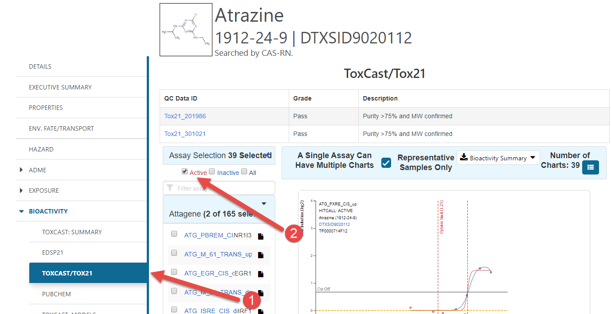
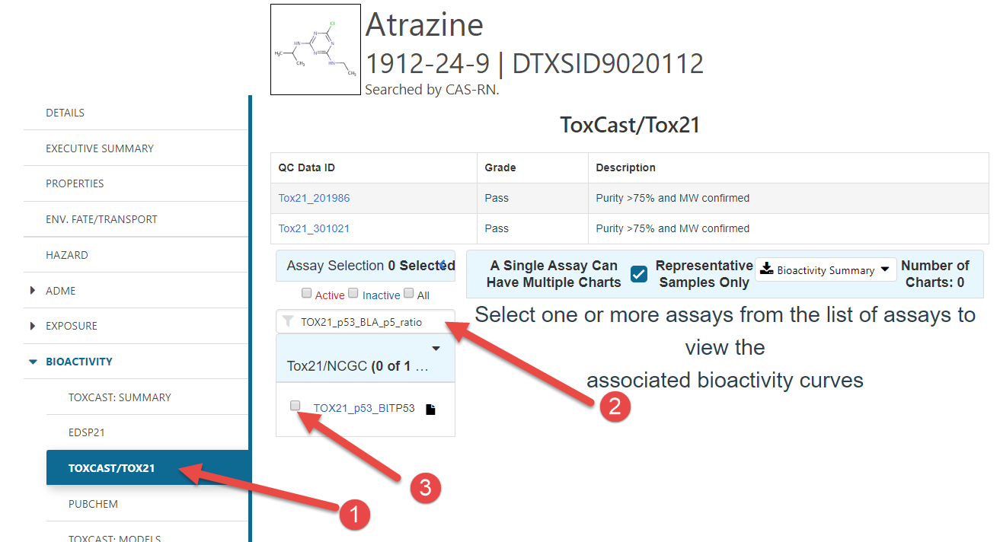
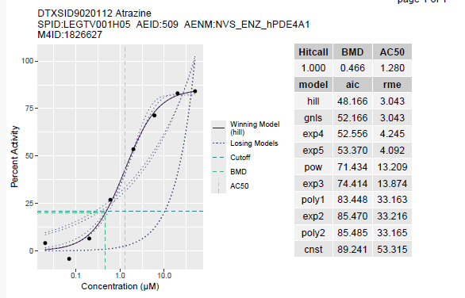

```{r setup, include=FALSE}
knitr::opts_chunk$set(echo = FALSE,
                      warning = FALSE,
                      message = FALSE)
library(tcpl)
```

The ToxCast database flags dose-response curves that may be unreliable or inconsistent based on several criteria; however, it is still good practice for the toxEval user to examine the dose-response curves pertinent their data to assure that results are understood and to gain confidence in the underlying data. At times, the user will find that dose-response curves for particular  chemical-endpoints or for an entire endpoint will need to be excluded from analysis. For chemicals with an extremely large EAR value, dose-response curves should be examined. Two ways to obtain dose-response curves are described below (the Comptox Dashboard and the tcpl pipeline).

## Comptox Dashboard

There is a web-based tool, the [Comptox Dashboard](https://comptox.epa.gov/dashboard) that allows you to search for a chemical by systematic name, synonym, CAS number, DTXSID, or InChIKey. Since we focus on CAS in the `toxEval` inputs, let's explore Atrazine (CAS = 1912-24-9):

```{r getAtrazine, echo=FALSE}
knitr::include_graphics("startSearch.png")
```


Enering the CAS will take you to a page describing properties of the specific chemical. There is a TON of great information there.

```{r getAtrazineAllActive, echo=FALSE}

```

1. Click the "Bioactivity" sidebar option, and then the ToxCast/ToxCast21 option.
2. Click the "Active" check box to see all of the dose-response curves that would be included in `toxEval`.


To get to a specific dose-response curve:

```{r getAtrazineCurve, echo=FALSE}

```


1. Click the "Bioactivity" sidebar option, and then the ToxCast/ToxCast21 option. 
2. Enter the specific endpoint of interest in the search box
3. Click the endpoint's check box

## R-package: tcpl

There is another way to locally produce the dose-response curves using the [`tcpl` package](https://cran.r-project.org/web/packages/tcpl/index.html). The advantage to this approach is that you can customize the plots and order of plots. The drawback is that you need to download a very large MySQL database and have it running locally. 

If the database has been downloaded, and MySQL is up-and-running, the following code would produce a single dose-response curve. Let's look at Atrazine with the "NVS_ENZ_hPDE4A1" endpoint:

```{r exampleTCPL, eval=FALSE, echo=TRUE}
library(tcpl)

tcplConf(drvr = "MySQL", 
         user = "my_awesome_username",
         pass = "my_awesome_password",
         host = "localhost", 
         db = "database_name")

ep <- "NVS_ENZ_hPDE4A1"
cas <- "1912-24-9"

chem_info <- tcplLoadChem(field = 'casn', val = cas)
head(chem_info, n = 1)

assay_info <- tcplLoadAcid(fld = "acnm", val = ep)
head(assay_info)

mc3 <- tcplLoadData(lvl = 3, type = "mc", 
             fld = c("acid","spid"), 
             val = list(assay_info$acid,
                        chem_info$spid))

## Load mc tables from levels of interest
mc4 <- tcplLoadData(lvl = 4, type = "mc", 
                    fld = c("spid", "aeid"), 
                    val = list(chem_info$spid,
                               unique(mc3$aeid)))

tcplPlotM4ID(mc4, lvl = 5)

```

```{r plotAtrazineCurve, echo=FALSE}

```


The values passed to the `tcplConf` function will depend on how you set up the MySQL database.


