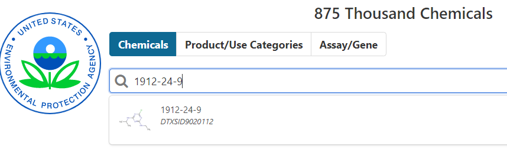

```{r setup, include=FALSE}
knitr::opts_chunk$set(echo = FALSE,
                      warning = FALSE,
                      message = FALSE)
```

The ToxCast database does a good job flagging dose-response curves that may be unreliable or inconsistent. However, the flags should not be the only source for chemical-endpoint exclusions. If you've got a chemical with an extremely large EAR, it is a good idea to check the dose-response curve. There are two ways to get that information described here.

## Comptox Dashboard

There is a tool, the [Comptox Dashboard](https://comptox.epa.gov/dashboard) that allows you to search for a chemical by systematic name, synonym, CAS number, DTXSID, or InChIKey. Since we focus on CAS in the `toxEval` inputs, let's explore Atrazine (CAS = 1912-24-9):

```{r getAtrazine, echo=FALSE}

```


