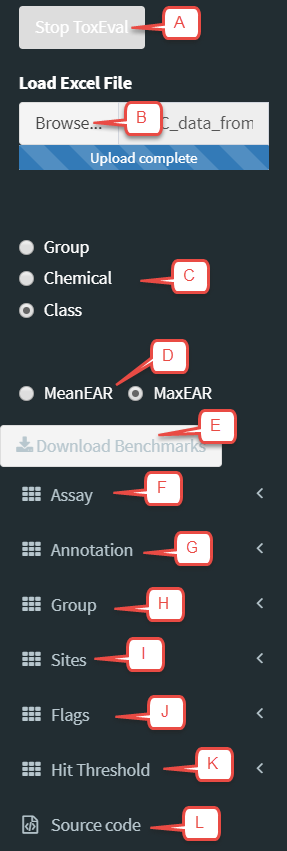
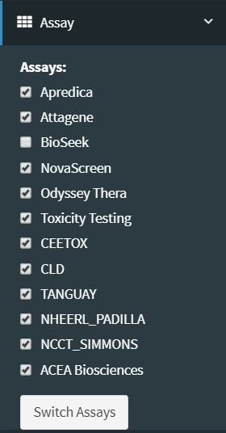
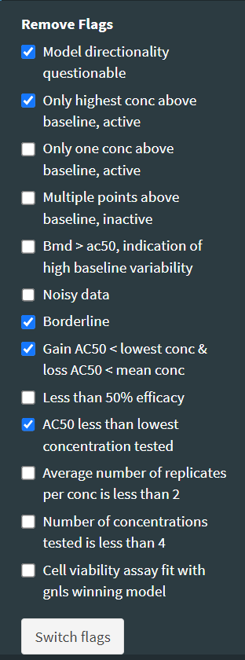

```{r setup, include=FALSE}
library(knitr)
library(rmarkdown)
options(continue=" ")
options(width=60)
knitr::opts_chunk$set(echo = TRUE,
                      warning = FALSE,
                      message = FALSE)
```


# Using the Shiny Application

The Shiny application (the app) is a quick and convenient way to explore data through a graphical user interface in the user's default browser. As with the R-package, ToxCast is the default biological endpoint database used to evaluate data. A user can override this default by providing a custom set of endpoints (e.g. aquatic life benchmarks).  

The interaction with the app is primarily "point and click". The app includes multiple ways to visualize data through boxplots, barcharts, tables and an overview map. Numerous options can be selected to customize presentation of data by choosing to focus on chemicals, chemical classes, biologically relevant endpoing groupings, and specific suites of ToxCast assays. All resulting graphics, tables, and data can be downloaded for use outside of the app.

While the app is useful and quite flexible as is, it also serves as a good starting point for a more in-depth user- and study-specific analysis. All of the output on the Shiny app can be created directly in R as well. For flexibility beyond what the app offers, the R-code to produce each graph and table is displayed in the app. The user may copy this code into a script and customize it for specific study needs. The help file for each function provides instructions and example workflows (R code) for their use.

To run the app, load the `toxEval` package, and run the `explore_endpoints` function:

```{r runApp, eval=FALSE}
library(toxEval)
explore_endpoints()
```

The computer's default browser will open up and display the following page:


The app can be divided into 3 main sections:

The left sidebar (with the black background) is used to load the data and set up the conditions for analysis. Options for this section are described in the "Sidebar" section below.

The main visualization display section includes a variety of tabs to choose from to explore the data in different ways. Each section is described in the section "Main Output".

The bottom section, "R Code:", displays the R code to reproduce the analysis directly in R using the `toxEval` R-package functions. The code can be copied and pasted directly into the R console, or (preferred for reproduciblity!) saved in an R script. Information on this option is provided below in the "R Code" section. 

## Sidebar options



The sidebar offers a host of options for customizing the analysis. This document will attempt to describe the logistics of options. This document will not go into the scientific details of what options to choose. These details are dependent on individual study objectives as defined by the user. An example case study that has defined options for a specific study of water quality has been published in [Blackwell te al., 2017](https://pubs.acs.org/doi/10.1021/acs.est.7b01613).


### A. Load Data File

Once the Shiny App has been launched, the first step is to load the data. The data should be prepared as described in the [Prepare Data vignette](PrepareData.html). Click on the "Browse" button and navigate to the properly prepared Excel file. Once a file is selected, the data will be loaded into the application. There is a progress bar while the data loads, but sometimes it may take a little more time to view the data as each individual graph/map/table also takes some time to develop.

Alternatively, there is a button "Load Example Data". This loads the example data provided within the `toxEval` package. This is a nice way to easily explore the application before preparing your own data.

### B. 'Group By' option

The "Group By" radio buttons affect all output in the application. For each function, the data will be summarized by summing individual EARs. How summations are grouped depends on this choice. 

The "Group" choice will group all of the endPoints that have similar groupings based on the options as determined by the designated "Annotation". The default annotation is "intended_target_family". With that choice, the "Group" radio button groups all EARs by the unique categories in the "intended_target_family" category.

The "Chemical" choice will group all of the endPoints in a single chemical (as defined by unique CAS).

The "Class" choice will group all of the endpoints in all of the chemicals for each chemical class as defined in the "Chemical" sheet in the Excel file.

### C. Mean and Maximum: Summarize by site

The options are "MeanEAR" and "MaxEAR", and they dictate how to summarize the EARs per site. Each site may have different numbers of collected samples. Mean or max can be chosen based on the objectives of specific analyses. 

### D. Download benchmarks

Clicking on this button will download the current set of benchmarks that is currently being used for `toxEval` computations as a comma delimited (csv) file. This file is formated such that it could be used in the "Benchmark" sheet (as described in the "Prepare Data" vignette). The provided columns are "CAS", "Chemical" (name), "flags", "endPoint", "ACC", "MlWt", "Value", "groupCol", and "assaysFull".

The "ACC" column is in log($\mu$M), and the "Value" column is the ACC converted to units of $\mu$g/L.
 
### E. Assay



The "Assay" dropdown menu offers the option to remove certain sets of assays from the analysis (see image to the right). By default, the "BioSeek" assay is not included. Clicking on any of the options will not have an immediate affect until the "Switch Assays" button is clicked.

### F. Annotations

The "Annotation" dropdown offers the choice of which ToxCast grouping to analyze. These options include columns that are available directly in the ToxCast database file. By default, the "intended_target_family" is picked, but there may be other more appropriate options based on the scope of the analysis. Choosing a new annotation will not have an immediate affect until the "Switch Annotation" button is clicked.

### G. Group

The options in the "Group" dropdown change depending on the choice in Annotations. For "intended_target_family" for example, there are 26 choices such as "Nuclear Receptors", "Cell Cycle", "DNA Binding", etc. Selected groups may be ignored in the analysis ("Background Measurement" for instance) by leaving the options unchecked. Clicking on and off the checkboxes will not have an immediate affect until the "Switch Groups" button is clicked.

### H. Flags



ToxCast endpoint:chemical assay results may have data quality flags associated with them. The "Flags" dropdown menu provide the user with a choice to include or exclude endpoints with specific flags associated with them. By default, endPoints flagged with "Noisy Data", "Only one conc above baseline, active", and "Hit-call potentially confounded by overfitting" are included in the analysis, and all other endpoints with associated flags are excluded. The scope of the analysis may user customization for flagged endPoints. Clicking on the flag checkboxes will not have an immediate affect until the "Switch Flags" button is clicked.

### I. Sites

By default, the analysis is done on all sites within the data set; however, the user can choose to explore results from individual sites using this dropdown menu. Each graph and table may show the individual site data a bit different than the full data set analysis. These differences are described in the "Basic Workflow" vignette.

### J. Hit Threshold

There are a few outputs (from the tabs: Hit Count, Site Hits, and Endpoint Hits) that will calculate the number of "Hits" which is simply the number of times the EAR is above a designated threshold. That threshold value is defined here. Changing the threshold will not have an immedate affect until the "Change Hit Threshold" button is clicked.

## Main Output
<table>
<tr><td>

Each plot and table offered in the app is described in the [Basic Workflow vignette](basicWorkflow.html). Please refer there for more information.

Each plot, table, and the map are generated by functions within the R-package. The table to the right indicates the function used for each tab in the app.

All resulting graphics, tables, and data can be downloaded for use outside of the app. Graphics are downloaded in "png" format and tables and data are are downloaded in "csv" format. In addition, R code to reproduce each analysis in the R environment is provided at the bottom of each tab. See the "R Code" section for details.


</td><td>

| Tab   |  Function |
|----------|------:|
| Map | [`make_tox_map`](basicWorkFlow.html#make_tox_map) |
| Box Plots | [`plot_tox_boxplots`](basicWorkFlow.html#plot_tox_boxplots) |
| Bar Charts | [`plot_tox_stacks`](basicWorkFlow.html#plot_tox_stacks)|
| Max EAR and Frequency | [`rank_sites_DT`](basicWorkFlow.html#rank_sites_DT)|
| Hit Counts | [`hits_summary_DT`](basicWorkFlow.html#hits_summary_DT)|
| Site Hits | [`hits_by_groupings_DT`](basicWorkFlow.html#hits_by_groupings_DT)|
| Endpoint Hits | [`endpoint_hits_DT`](basicWorkFlow.html#endpoint_hits_DT)|
| Endpoint | [`plot_tox_endpoints`](basicWorkFlow.html#plot_tox_endpoints)|
| Heat Map | [`plot_tox_heatmap`](basicWorkFlow.html#plot_tox_heatmap)|

</td></tr> </table>

## R Code

Each tab is generated based on specific functions within the R-Package, and the appropriate code to reproduce results from each tab is provided at the bottom of the tab. Modification of this code in the R environment allows the user to customize plots and tables based on specific study needs. 

The app provides many graphics and tables to work through a data analysis, some users may wish to have a record of what has been done, or to save specific analyses that prove to be particularly useful. By copying and pasting the R code, users by developing a "workflow" script that has all analysis saved in one place rather than needing to go through the process of choosing the many options needed to reproduce exactly what was done previously in the app. This workflow can serve as a valuable resource that results in reliably reproducible research. In the event of a need to modify a data set, it can also be used to efficiently update a data analysis without having to reproduce each step in the app manually.

# Logistics

## Reporting bugs

Please consider reporting bugs and asking questions on the Issues page:
[https://github.com/USGS-R/toxEval/issues](https://github.com/USGS-R/toxEval/issues)

## Citing toxEval


```{r}
citation(package = "toxEval")
```


## Disclaimer

This software has been approved for release by the U.S. Geological Survey (USGS). Although the software has been subjected to rigorous review, the USGS reserves the right to update the software as needed pursuant to further analysis and review. No warranty, expressed or implied, is made by the USGS or the U.S. Government as to the functionality of the software and related material nor shall the fact of release constitute any such warranty. Furthermore, the software is released on condition that neither the USGS nor the U.S. Government shall be held liable for any damages resulting from its authorized or unauthorized use.

Any use of trade, firm, or product names is for descriptive purposes only and does not imply endorsement by the U.S. Government.